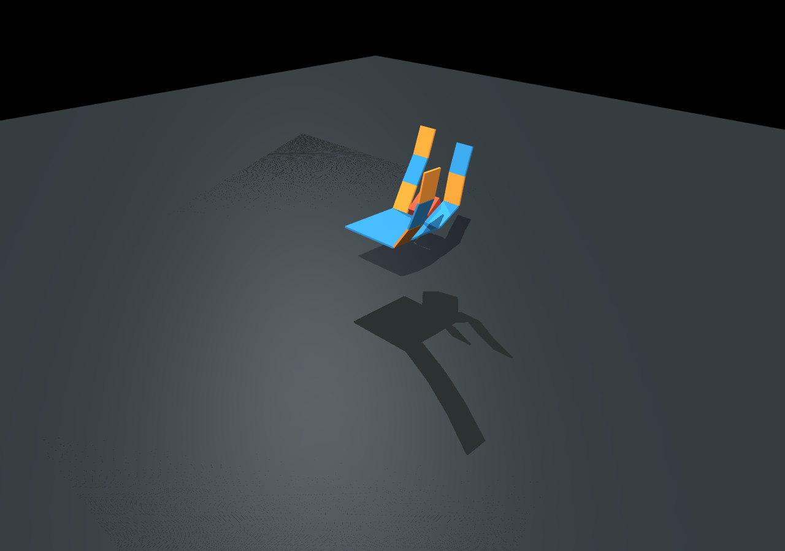
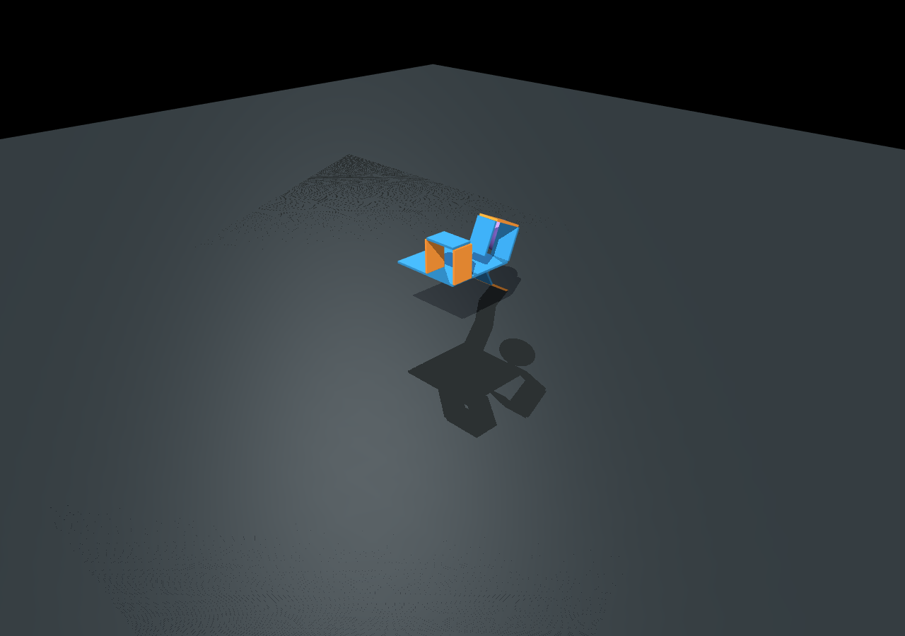
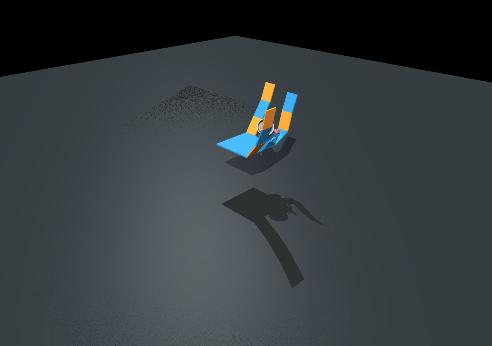

# MuJoCo 接触与自适应抓取 Demo

本文记录本项目新增的接触/碰撞接口、GitHub 物体资产来源，以及四个可复现的折纸灵巧手自适应抓取 demo。

## 资产来源

本次检索了两个 MuJoCo 资产来源：

| 来源 | 链接 | 采用情况 |
|---|---|---|
| MuJoCo Menagerie | https://github.com/google-deepmind/mujoco_menagerie | 作为参考来源，偏机器人本体模型 |
| MuJoCo Scanned Objects | https://github.com/kevinzakka/mujoco_scanned_objects | 已采用，适合抓取物体 demo |

本项目实际 vendored 了 `mujoco_scanned_objects` 中的三个物体：

| 物体 | 本地路径 |
|---|---|
| coffee mug | `assets/mujoco_scanned_objects/ACE_Coffee_Mug_Kristen_16_oz_cup` |
| Jenga block | `assets/mujoco_scanned_objects/2_of_Jenga_Classic_Game` |
| hammer ball | `assets/mujoco_scanned_objects/HAMMER_BALL` |

该资产目录中的 `README.md`、`UPSTREAM_README.md` 和 `LICENSE` 记录了来源与许可。上游 XML 为 MIT license，3D 资产按上游说明为 CC-BY 4.0。

## 新增接口

`.ohd` 仿真定义现在支持：

```json
"contact": {
  "enabled": true,
  "hand_contact": true,
  "object_contact": true,
  "floor_contact": true,
  "hand_floor_contact": false,
  "friction": [1.1, 0.01, 0.0001],
  "margin": 0.0002,
  "floor_z": -0.015
}
```

以及物体定义：

```json
"objects": [
  {
    "name": "adaptive_cylinder",
    "type": "cylinder",
    "pos": [0.045, 0.125, 0.0785],
    "size": [0.018, 0.03],
    "rgba": [0.20, 0.62, 0.58, 1.0],
    "mass": 0.5,
    "freejoint": true
  }
]
```

外部 scanned object 可写为：

```json
"objects": [
  {
    "name": "scanned_mug",
    "type": "scanned",
    "model_path": "../../assets/mujoco_scanned_objects/ACE_Coffee_Mug_Kristen_16_oz_cup/model.xml",
    "scale": 0.45,
    "pos": [0.045, 0.125, 0.0785],
    "mass": 0.5,
    "freejoint": true
  }
]
```

## 碰撞分组

生成的 MJCF 使用 MuJoCo `contype/conaffinity` 进行分组：

| 几何体 | `contype` | `conaffinity` | 说明 |
|---|---:|---:|---|
| hand | 1 | 2 | 手只与物体碰撞，默认不自碰撞 |
| object | 2 | 5 | 物体与手和地面碰撞 |
| floor | 4 | 2 | 地面与物体碰撞 |

这样做可以避免折纸手 mesh 自碰撞把运动卡住，同时保留手-物体、物体-地面的接触。

实现仍然不包含阻尼器：不生成 `<damper>`，不写 `damping`，也没有 `-D q_dot` 速度阻尼反馈。

## Demo 命令

### 图形化入口

如果不希望通过终端参数操作，可以打开 PyQt 图形界面：

```powershell
python scripts\run_mujoco_sdas_gui.py
```

界面中可以直接完成以下操作：

| 区域 | 功能 |
|---|---|
| Simulation File | 选择 `.ohd` 文件和输出目录 |
| Analysis Steps | 设置仿真总时长和分析步数，界面自动显示 `dt` |
| Grasp Object and Contact | 选择 `keep/none/box/cylinder/sphere/scanned_mug`，设置物体位置、尺寸、质量、是否固定、是否打开接触 |
| Output | 选择是否导出过程 GIF、设置 GIF 帧率、是否保留逐帧 PNG |
| Run MuJoCo Simulation | 启动数值仿真 |
| Result Panel | 显示 summary JSON，预览截图或播放 GIF，打开输出目录 |

这是当前推荐给普通用户的入口。CLI 仍保留给批量实验和自动化测试。

### 直接运行已写好的 `.ohd`

```powershell
python scripts\run_mujoco_sdas.py "models\ohd test\mujoco_sdas_grasp_box.ohd"
python scripts\run_mujoco_sdas.py "models\ohd test\mujoco_sdas_grasp_cylinder.ohd"
python scripts\run_mujoco_sdas.py "models\ohd test\mujoco_sdas_grasp_sphere.ohd"
python scripts\run_mujoco_sdas.py "models\ohd test\mujoco_sdas_grasp_scanned_mug.ohd"
```

### 通过终端覆盖分析步和抓取物品

当前用户入口是命令行脚本：

```powershell
python scripts\run_mujoco_sdas.py <仿真或手部 .ohd 文件> [参数]
```

例如，用户选择基础 `.ohd`，设置总时长为 `1.0 s`、分析步数为 `500`，抓取物体选 cylinder，并指定输出目录：

```powershell
python scripts\run_mujoco_sdas.py "models\ohd test\mujoco_sdas_step.ohd" --duration 1.0 --steps 500 --object cylinder --out outputs\mujoco_sdas\cli_cylinder_demo
```

这条命令会自动计算：

```text
dt = duration / steps = 1.0 / 500 = 0.002 s
```

可用参数：

| 参数 | 作用 |
|---|---|
| `<ohd_file>` | 选择手部 `.ohd` 或仿真定义 `.ohd` |
| `--duration 1.4` | 设置仿真总时长 |
| `--steps 700` | 设置分析步数，自动换算 `dt` |
| `--dt 0.002` | 直接设置 MuJoCo 时间步长；若同时给 `--steps`，以 `--steps` 为准 |
| `--object keep` | 使用 `.ohd` 中已有物体，默认值 |
| `--object none` | 不加入抓取物体 |
| `--object box` | 加入 box 抓取物体 |
| `--object cylinder` | 加入 cylinder 抓取物体 |
| `--object sphere` | 加入 sphere 抓取物体 |
| `--object scanned_mug` | 加入 vendored scanned mug 资产 |
| `--object-pos X Y Z` | 覆盖物体初始位置 |
| `--object-size ...` | 覆盖 procedural 物体尺寸 |
| `--object-scale S` | 覆盖 scanned object 缩放 |
| `--object-mass M` | 覆盖物体质量 |
| `--fixed-object` | 物体不加 freejoint，用作固定测试件 |
| `--contact` | 即使 `.ohd` 没有 contact 字段，也强制打开接触 |
| `--out DIR` | 设置输出目录 |
| `--video` | 输出仿真过程 GIF |
| `--video-fps 12` | 设置 GIF 帧率 |
| `--keep-video-frames` | 保留中间帧 PNG，默认合成后删除 |

更多例子：

```powershell
# 选择 sphere，使用 700 个分析步
python scripts\run_mujoco_sdas.py "models\ohd test\mujoco_sdas_step.ohd" --duration 1.4 --steps 700 --object sphere --out outputs\mujoco_sdas\manual_sphere

# 选择 scanned mug，并调整缩放和位置
python scripts\run_mujoco_sdas.py "models\ohd test\mujoco_sdas_step.ohd" --duration 1.4 --steps 700 --object scanned_mug --object-scale 0.45 --object-pos 0.045 0.125 0.0785 --video --video-fps 12 --out outputs\mujoco_sdas\manual_mug

# 使用 .ohd 内定义的物体，但只覆盖分析步数
python scripts\run_mujoco_sdas.py "models\ohd test\mujoco_sdas_grasp_cylinder.ohd" --steps 700
```

目前没有单独的 GUI；如果需要图形化入口，建议下一步做一个 PyQt launcher：左侧选择 `.ohd`，中间设置 `duration/steps/object`，右侧显示输出截图和 summary。

## 结果汇总

| Demo | 分布 | 接触步数 | 最大接触数 | 最大总接触力 | 截图目录 |
|---|---|---:|---:|---:|---|
| box | `sdas` | 146 | 5 | 4.395 | `outputs/mujoco_sdas/grasp_box` |
| cylinder | `sdas` | 158 | 5 | 4.415 | `outputs/mujoco_sdas/grasp_cylinder` |
| sphere | `uniform` | 531 | 2 | 120.234 | `outputs/mujoco_sdas/grasp_sphere` |
| scanned mug | `sdas` | 209 | 7 | 0.623 | `outputs/mujoco_sdas/grasp_scanned_mug` |

推荐优先展示 cylinder 和 scanned mug：它们既有清楚的手-物体接触画面，也有比较温和的接触力数值。

## 展示截图








## 输出日志

CSV/NPZ 中新增：

| 字段 | 含义 |
|---|---|
| `ncon` | 当前 MuJoCo 接触点数量 |
| `contact_force_total` | 当前所有接触点的力范数求和 |
| `object_<name>_x/y/z` | 物体世界坐标 |

`summary.json` 中新增：

| 字段 | 含义 |
|---|---|
| `object_count` | 物体数量 |
| `contact_enabled` | 是否打开接触 |
| `contact_steps` | 出现接触的仿真步数 |
| `max_contacts` | 单步最大接触点数量 |
| `max_contact_force` | 单步最大总接触力 |
| `video` | 过程 GIF 路径；未开启视频时为 `null` |

## 过程视频

默认输出只有关键时刻截图，不生成视频。需要视频时加：

```powershell
python scripts\run_mujoco_sdas.py "models\ohd test\mujoco_sdas_grasp_scanned_mug.ohd" --video --video-fps 12
```

已生成的示例过程 GIF：

```text
outputs/mujoco_sdas/grasp_scanned_mug/mujoco_sdas_grasp_scanned_mug_video.gif
outputs/mujoco_sdas/cli_cylinder_video/mujoco_sdas_step_video.gif
```

## 当前解释边界

这些 demo 的目标是证明 `.ohd -> SDAS/control distribution -> MuJoCo contact simulation` 已经打通。它们还不是完整硬件级抓取评估，因为当前折纸手 link 仍使用简化 mesh 碰撞，指尖厚度、柔性材料、真实重力抓取和接触力标定还需要后续细化。

更适合论文中的表述是：

> 我们实现了基于 MuJoCo 的接触感知 SDAS 数值仿真接口，并通过 box、cylinder、sphere 和 scanned mug 四类物体验证了折纸灵巧手在低维协同输入下能够与外部物体发生可记录的碰撞和接触响应。
