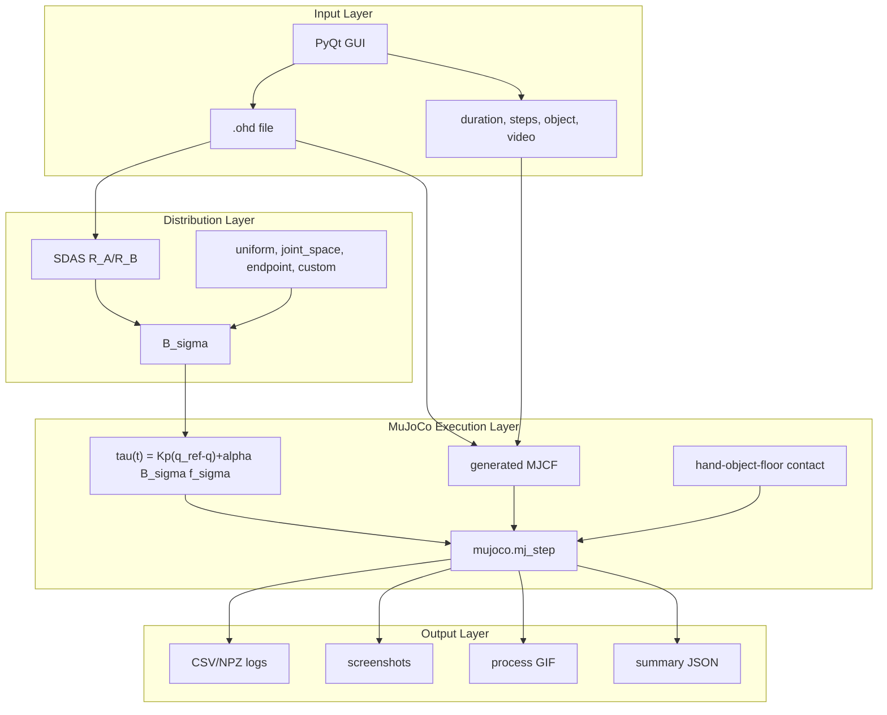

# SDAS MuJoCo 数值仿真海报内容稿

_版面比例：Problem Statement : Literature Review : Methodology : Experimental Result : Conclusion = 5 : 5 : 4 : 5 : 1。对应海报面积建议约为 25% : 25% : 20% : 25% : 5%。_

本文是给海报人工排版用的素材库。每个部分包含：

- 可直接放进海报的正文
- 推荐公式
- 推荐图片/结果图
- 图注建议
- 版面提示

---

## 0. 海报总标题与核心信息

### 推荐标题

**Modeling Adaptive Grasping in a Cable-Driven Origami Dexterous Hand**

中文标题可写为：

**面向索驱动折纸灵巧手自适应抓取的建模与仿真**

### 推荐副标题

**Introducing SDAS: a state-dependent tendon transmission model connected to MuJoCo contact simulation.**

中文副标题可写为：

**提出 SDAS 状态相关索传动模型，并将其连接到 MuJoCo 接触仿真。**

### 海报一句话贡献

本项目提出 SDAS 状态相关自适应协同模型，用于解释双端闭环索驱动折纸灵巧手的自适应抓取，并将该模型实现为可由图形化界面运行的 MuJoCo 接触数值仿真流程；系统支持 `.ohd` 选择、分析步设置、抓取物体选择、关节日志、接触统计、截图和过程 GIF 输出。

### 推荐总体流程图

```mermaid
flowchart LR
    accTitle: Overall SDAS MuJoCo Simulation Pipeline
    accDescr: The poster pipeline from OHD model definition to SDAS distribution, MuJoCo numerical integration, contact-aware grasping results, and GUI outputs.

    ohd[".ohd hand and simulation definition"] --> gui["PyQt GUI launcher"]
    gui --> parser["model, time steps, drivers, object selection"]
    parser --> dist["SDAS or custom distribution B_sigma"]
    dist --> target["q_ref(t) = B_sigma sigma(t)"]
    target --> force["generalized force tau(t)"]
    force --> mujoco["MuJoCo mj_step"]
    mujoco --> results["joint logs, contact logs, screenshots, GIF"]
```



---

## 1. Problem Statement（比例 5）

### 海报正文建议

现有 `synergy_hand_sim` 已经能够从 `.ohd` 或 DXF 文件构建折纸灵巧手的几何拓扑、协同矩阵和 URDF/MJCF 可视化模型。然而，原始几何仿真主要输出协同输入对应的目标构型 `q_ref`，只能说明“手应该运动到哪里”，不能回答“在物理约束、惯性、接触和时间积分下，手实际怎样运动”。对于折纸灵巧手和欠驱动协同抓取而言，这一差异非常关键：接触物体后，实际关节角 `q(t)` 不一定等于几何目标 `q_ref(t)`，而这种偏差正是柔顺性、自适应闭合和抓取接触响应的来源。

本项目面向索驱动折纸灵巧手建立 SDAS-MuJoCo 数值仿真流程。核心问题是：如何从双端闭环索的路径相关传动出发，推导出可解释的自适应协同模型，并将该模型转化为可记录、可截图、可交互配置的 MuJoCo 接触仿真？进一步地，用户不应只通过复杂命令行运行实验，而应能够通过图形化界面选择 `.ohd`、设置仿真总时长和分析步数、选择抓取物体、打开接触与视频输出，并直接查看结果。

本升级的展示重点不是软件约束本身，而是模型链路：从双端索传动的路径相关张力分布，推导 SDAS 自适应协同基，再把协同输入映射到 MuJoCo 中求解关节运动、接触力和抓取过程。

### 问题可拆成三个层次

| 层次 | 原几何仿真的状态 | 本项目升级目标 |
|---|---|---|
| 运动描述 | 由协同矩阵直接给出目标构型 `q_ref` | 由 MuJoCo 数值积分得到实际状态 `q(t)` |
| 接触抓取 | 无接触或只做静态姿态展示 | 加入 hand-object-floor 碰撞分组和接触日志 |
| 用户入口 | 需要理解脚本参数和 `.ohd` JSON | 提供 PyQt GUI 选择文件、分析步、物体和输出 |

### 推荐放置公式

**公式 P1：几何协同目标**

```math
q_\mathrm{ref}(t) = B_\sigma \sigma(t)
```

含义：几何仿真只给出参考姿态，不包含物理积分和接触响应。

**公式 P2：几何目标与数值状态差异**

```math
e_q(t) = q(t) - q_\mathrm{ref}(t)
```

含义：数值仿真的价值来自 `q(t)` 与 `q_ref(t)` 的差异。接触、惯性和约束都会改变实际状态。

**公式 P3：分析步与时间步长**

```math
\Delta t = \frac{T}{N}
```

含义：GUI 中用户设置总时长 `T` 和分析步数 `N`，系统自动计算 MuJoCo timestep。

### 推荐放置图片

| 图片 | 路径 | 用途 |
|---|---|---|
| 几何目标 vs MuJoCo 状态对比图 | `outputs/mujoco_sdas/step_demo/mujoco_sdas_step_geometry_vs_mujoco.png` | 展示几何仿真和数值仿真的差异 |
| 原始自由空间姿态截图 1 | `outputs/mujoco_sdas/step_demo/mujoco_sdas_step_t0.350.png` | 展示早期姿态 |
| 原始自由空间姿态截图 2 | `outputs/mujoco_sdas/step_demo/mujoco_sdas_step_t1.050.png` | 展示后期姿态 |

### 推荐图注

**Fig. 1. Geometry target versus MuJoCo numerical state.** The dashed trajectories represent the synergy-generated reference configuration, while solid curves represent the MuJoCo state after numerical integration. The mismatch indicates the transition from geometry-only simulation to physics-aware simulation.

中文图注：

**图 1. 几何目标与 MuJoCo 数值状态对比。** 虚线为协同矩阵生成的参考构型，实线为 MuJoCo 积分后的实际关节状态。二者差异体现了从几何仿真到数值仿真的升级价值。

### 版面提示

建议 Problem Statement 放在海报左上角，占比约 25%。该部分应该先用一句话定义矛盾：**几何仿真给出目标，数值仿真给出真实响应**。然后用一个小表格说明原系统不足和新系统目标。最后用公式 `q_ref = B_sigma sigma` 与 `e_q = q - q_ref` 引出后续方法。

---

## 2. Literature Review（比例 5）

### 海报正文建议

手部协同理论源于人手抓握姿态的低维结构观察。Santello 等的研究表明，人手在抓取不同物体时虽然具有大量关节自由度，但主要姿态变化可由少数主成分解释。这启发了姿态协同模型：用低维协同变量 `sigma` 表示高维关节构型 `q`。该思想非常适合折纸灵巧手，因为折痕、腱绳和折纸面片本身就倾向于将多个自由度组织成成组运动。

Bicchi、Gabiccini 等提出的 soft synergy 模型进一步指出，协同输入不应被理解为刚性姿态命令，而应作为参考构型；真实手部在接触物体时会沿柔顺方向偏离该参考构型。这个思想对本项目非常重要：几何仿真的 `q_ref` 应该进入物理仿真，而不是被视为最终状态。

Pisa/IIT SoftHand 系列工作将 soft synergy 进一步转化为机械结构。经典自适应协同模型使用传动矩阵 `R` 描述驱动器位移与关节运动的关系，并通过刚度矩阵 `E` 推导出从驱动器空间到关节空间的等效映射。该结果为本项目的 `.ohd -> distribution -> MuJoCo` 接口提供了数学基础。

SoftHand 2 和 SoftHand Pro-D 相关工作进一步讨论了增强自适应协同、腱绳相对滑动、动态协同和状态相关响应。它们说明多协同方向可以通过传动结构、腱路顺序和状态相关传动来产生。这些工作为本项目提供了低维控制和多协同方向的背景，但并没有直接给出折纸闭环索驱动手的 SDAS 模型。

SDAS 是本项目提出的模型，核心目标是描述双端闭环腱绳系统中的状态依赖传动。对于驱动端 A 和 B，模型分别构建不同的一侧传动向量 `R_A`、`R_B`，再由关节刚度和 Schur 补推导出两个协同方向 `S_A`、`S_B`。因此，文献综述应当把既有工作写成动机和对照，而不是把 SDAS 写成已有文献结论。

### 文献脉络表

| 理论/工作 | 核心思想 | 对本项目的作用 |
|---|---|---|
| Santello postural synergies | 人手姿态可由低维主成分近似 | 支持用 `sigma` 控制高维折纸手 |
| Soft synergy | 参考姿态与接触柔顺性结合 | 将 `q_ref` 作为物理仿真的参考而非最终状态 |
| Adaptive synergy | 传动矩阵 `R` 和刚度 `E` 产生欠驱动协同 | 提供从驱动输入到关节分布的数学形式 |
| Pisa/IIT SoftHand | 少量驱动器实现高维被动顺应 | 指导低维主动、高维响应的仿真目标 |
| SoftHand 2 | 腱绳相对滑动产生增强协同方向 | 启发多列 `B_sigma` 的工程接口 |
| SoftHand Pro-D | 动态协同与状态相关控制 | 作为背景综述，说明多协同方向的重要性 |
| SDAS, this work | 状态依赖双端传动 `R_A/R_B` | 本项目首次提出的折纸手协同建模框架 |
| MuJoCo | 约束、接触和动力学数值求解 | 作为唯一物理仿真引擎 |

### 推荐放置公式

**公式 L1：姿态协同**

```math
q = S\sigma
```

含义：低维协同变量 `sigma` 表示高维关节构型。

**公式 L2：soft synergy**

```math
q = S\sigma - C J^\mathsf{T} f_\mathrm{ext}
```

含义：外部接触力使实际构型偏离协同参考构型。

**公式 L3：传动约束**

```math
R q = x
```

含义：驱动器位移 `x` 与关节构型 `q` 之间由传动矩阵 `R` 约束。

**公式 L4：虚功对偶**

```math
\tau = R^\mathsf{T}\tau_M
```

含义：驱动器力矩通过传动矩阵转置映射为关节广义力。

**公式 L5：adaptive synergy 映射**

```math
q = E^{-1}R^\mathsf{T}(R E^{-1}R^\mathsf{T})^{-1}x
```

含义：在自由空间中，传动矩阵和刚度矩阵共同定义从驱动器输入到关节姿态的映射。

**公式 L6：SDAS 双端协同方向**

```math
S_A = E^{-1}R_A^\mathsf{T}(R_A E^{-1}R_A^\mathsf{T})^{-1}
```

```math
S_B = E^{-1}R_B^\mathsf{T}(R_B E^{-1}R_B^\mathsf{T})^{-1}
```

含义：双端闭环腱绳的 A/B 两端可生成两个不同协同方向。

**公式 L7：分布矩阵组合**

```math
B_\sigma =
\begin{bmatrix}
S_A & S_B
\end{bmatrix}
```

含义：SDAS 方向统一进入本项目的 MuJoCo 控制接口。

### 推荐放置图片

文献综述区尽量不要直接截图论文图片。推荐人工重画三张小示意：

| 图 | 内容 | 备注 |
|---|---|---|
| Literature timeline | Santello -> Soft synergy -> Pisa/IIT SoftHand -> SoftHand 2 -> SDAS/MuJoCo | 用横向时间线即可 |
| Synergy concept sketch | `sigma` 低维输入映射到多关节 `q` | 可用方块箭头图 |
| Transmission sketch | 双端驱动 `R_A/R_B` 到 `S_A/S_B` | 展示 SDAS 双端特征 |

### 推荐图注

**Fig. 2. Literature pathway from postural synergy to the proposed SDAS model.** Previous work motivates the use of low-dimensional control, adaptive transmission, and multi-synergy mappings. The present work proposes SDAS for two-ended tendon transmission and connects it to MuJoCo contact simulation.

中文图注：

**图 2. 从姿态协同到本文提出的 SDAS 模型。** 既有工作支撑低维协同控制、自适应传动和多协同方向设计；本项目针对双端闭环索驱动提出 SDAS，并将其连接到 MuJoCo 接触仿真。

### 版面提示

Literature Review 建议放在海报左中或上中，占比约 25%。不要写成大段论文综述，最好用一张时间线和一个公式簇。核心信息是：**已有工作解释了为什么要用协同和柔顺抓取，但本文提出 SDAS 来解决双端闭环索驱动中的状态相关传动。**

---

## 3. Methodology（比例 4）

### 海报正文建议

方法部分由四个层次组成。第一层是用户输入层：用户通过 PyQt GUI 选择 `.ohd` 文件、输出目录、仿真总时长、分析步数、抓取物体和视频输出。第二层是协同分布层：系统从 `.ohd` 中读取折纸手模型和 SDAS 结构，构造分布矩阵 `B_sigma`；也支持 `uniform`、`joint_space`、`endpoint` 和自定义矩阵。第三层是 MuJoCo 执行层：系统从 URDF/MJCF 生成 MuJoCo 模型，写入手部、物体和地面的碰撞分组，并在每个时间步将协同目标和协同力输入转为关节广义力。第四层是输出层：系统记录关节角、参考构型、驱动力矩、接触点数量、总接触力和物体位姿，并导出截图、对比图和过程 GIF。

对于 position 输入，用户命令被解释为协同坐标 `sigma(t)`；对于 velocity 输入，系统将其积分为协同坐标；对于 force 输入，系统将其映射为协同空间广义力。最终施加到 MuJoCo 的关节力由 SDAS 参考姿态误差项和协同力输入项组成。

接触建模采用 MuJoCo 的 `contype/conaffinity` 分组策略。手部几何体只与物体碰撞，避免折纸面片之间的自碰撞导致仿真卡死；物体同时与手和地面碰撞；地面只与物体碰撞。该策略在保持计算稳定性的同时，能够记录 hand-object contact 对手部自适应闭合的影响。

### 推荐方法流程



### 推荐放置公式

**公式 M1：协同目标**

```math
q_\mathrm{ref}(t) = B_\sigma \sigma(t)
```

**公式 M2：速度输入积分**

```math
\sigma_i(t+\Delta t) = \sigma_i(t) + v_i(t)\Delta t
```

注意：这里的 velocity 是用户输入类型，表示用户给定的协同速度命令。

**公式 M3：力输入映射**

```math
\tau_\mathrm{force}(t) = \alpha B_\sigma f_\sigma(t)
```

**公式 M4：SDAS 控制映射**

```math
\tau(t) =
K_p\left(q_\mathrm{ref}(t)-q(t)\right)
+ \alpha B_\sigma f_\sigma(t)
```

**公式 M5：MuJoCo 数值动力学抽象**

```math
M(q)\ddot{q} + h(q,\dot{q})
= \tau(t) + J_c(q)^\mathsf{T}\lambda
```

含义：手部接触和约束由 MuJoCo 处理，SDAS 提供进入数值求解器的关节空间输入。

**公式 M6：接触力日志**

```math
F_\mathrm{contact,total}(t)
= \sum_{i=1}^{n_c(t)} \|f_{c,i}(t)\|
```

含义：CSV/NPZ 中的 `contact_force_total` 为每个时间步所有接触点力范数的求和。

### 推荐放置图片

| 图片 | 路径 | 用途 |
|---|---|---|
| GUI 界面截图 | 建议运行 `python scripts/run_mujoco_sdas_gui.py` 后手动截屏 | 展示用户友好接口 |
| 方法流程图 | 可根据上方 Mermaid 人工重画 | 展示 pipeline |
| MJCF/contact 分组小图 | 建议人工画 hand/object/floor 三组 | 展示碰撞策略 |

### GUI 说明可放在海报边角

图形化入口：

```powershell
python scripts\run_mujoco_sdas_gui.py
```

GUI 支持：

| 功能 | 描述 |
|---|---|
| `.ohd` 选择 | Browse 选择仿真定义文件 |
| 分析步设置 | 输入 `duration` 和 `steps`，自动计算 `dt` |
| 抓取物体选择 | `keep`、`none`、`box`、`cylinder`、`sphere`、`scanned_mug` |
| 接触开关 | 启用 hand-object-floor collision |
| 视频输出 | 导出 `*_video.gif` |
| 结果预览 | 显示 summary、截图或 GIF |

### 版面提示

Methodology 占比约 20%。不要把方法区写得过长，应突出一个中心图：`two-ended tendon routing -> R_A/R_B -> S_A/S_B -> q_ref/tau_SDAS -> MuJoCo contact solve`。GUI 和 `.ohd` 入口可以放在边角，中心应留给 SDAS 建模推导。

---

## 4. Experimental Result（比例 5）

### 海报正文建议

实验分为两类。第一类是自由空间协同输入实验，用于验证几何目标和 MuJoCo 数值状态的差异。示例使用 `three_finger_gripper_b`，包含 9 个关节、2 个 SDAS 驱动器，总时长 `1.2 s`，时间步长 `0.002 s`，共 600 步。结果显示，几何目标与 MuJoCo 状态之间存在可记录的动态差异，RMS 误差为 `0.1848 rad`，最大绝对误差为 `0.5661 rad`。这说明系统不再只是直接显示协同几何目标，而是通过 MuJoCo 数值推进得到实际状态。

第二类是接触抓取实验，用于验证手-物体碰撞和自适应闭合。实验包含 box、cylinder、sphere 和 scanned mug 四类物体。其中 box、cylinder 和 scanned mug 使用 SDAS 分布，sphere 使用 uniform 分布作为强接触对照。所有抓取实验总时长为 `1.4 s`，时间步长为 `0.002 s`，共 700 步。系统记录接触步数、最大接触点数量、最大总接触力、关节误差和物体位姿。

结果表明，cylinder 和 scanned mug 是最适合海报展示的两个 demo。Cylinder 抓取中出现 158 个接触步，最大接触点数量为 5，最大总接触力约为 4.415，RMS 误差为 0.1816 rad。Scanned mug 使用来自 GitHub `mujoco_scanned_objects` 的真实 mesh/V-HACD collision 资产，出现 209 个接触步，最大接触点数量为 7，最大总接触力约为 0.623，RMS 误差为 0.1821 rad。该实验说明外部抓取物体资产可以被集成进 `.ohd` 驱动的 MuJoCo 数值仿真流程。

### 自由空间数值仿真结果

| 指标 | 数值 |
|---|---:|
| hand model | `three_finger_gripper_b` |
| joints | 9 |
| drivers | 2 |
| distribution | `sdas` |
| duration | 1.2 s |
| dt | 0.002 s |
| steps | 600 |
| RMS error | 0.1848 rad |
| max absolute error | 0.5661 rad |

### 接触抓取结果

| Demo | 物体类型 | 分布 | 接触步数 | 最大接触数 | 最大总接触力 | RMS error |
|---|---|---|---:|---:|---:|---:|
| grasp_box | box | `sdas` | 146 | 5 | 4.395 | 0.1913 rad |
| grasp_cylinder | cylinder | `sdas` | 158 | 5 | 4.415 | 0.1816 rad |
| grasp_sphere | sphere | `uniform` | 531 | 2 | 120.234 | 1.0232 rad |
| grasp_scanned_mug | scanned mug | `sdas` | 209 | 7 | 0.623 | 0.1821 rad |

### 推荐放置图片

最推荐放入海报的图片：

| 推荐优先级 | 图片 | 路径 | 原因 |
|---:|---|---|---|
| 1 | cylinder 抓取末态 | `outputs/mujoco_sdas/grasp_cylinder/mujoco_sdas_grasp_cylinder_t1.250.png` | 接触清楚、物体在两指之间、数值稳定 |
| 2 | scanned mug 抓取末态 | `outputs/mujoco_sdas/grasp_scanned_mug/mujoco_sdas_grasp_scanned_mug_t1.250.png` | 展示 GitHub 真实物体资产 |
| 3 | 几何 vs MuJoCo 对比图 | `outputs/mujoco_sdas/step_demo/mujoco_sdas_step_geometry_vs_mujoco.png` | 证明从几何到数值仿真的差异 |
| 4 | box 抓取末态 | `outputs/mujoco_sdas/grasp_box/mujoco_sdas_grasp_box_t1.250.png` | 补充不同形状 |
| 5 | scanned mug GIF | `outputs/mujoco_sdas/grasp_scanned_mug/mujoco_sdas_grasp_scanned_mug_video.gif` | 可用于现场展示或二维码链接 |

可选补充图片：

| 图片 | 路径 |
|---|---|
| cylinder 初期 | `outputs/mujoco_sdas/grasp_cylinder/mujoco_sdas_grasp_cylinder_t0.150.png` |
| cylinder 中期 | `outputs/mujoco_sdas/grasp_cylinder/mujoco_sdas_grasp_cylinder_t0.750.png` |
| cylinder 末期 | `outputs/mujoco_sdas/grasp_cylinder/mujoco_sdas_grasp_cylinder_t1.250.png` |
| scanned mug 初期 | `outputs/mujoco_sdas/grasp_scanned_mug/mujoco_sdas_grasp_scanned_mug_t0.150.png` |
| scanned mug 中期 | `outputs/mujoco_sdas/grasp_scanned_mug/mujoco_sdas_grasp_scanned_mug_t0.750.png` |
| scanned mug 末期 | `outputs/mujoco_sdas/grasp_scanned_mug/mujoco_sdas_grasp_scanned_mug_t1.250.png` |

### 推荐图注

**Fig. 3. Free-space SDAS step input simulation.** A two-driver SDAS input generates a geometric target configuration, while MuJoCo produces the numerically integrated state. The RMS difference between reference and numerical state is 0.1848 rad over 600 steps.

中文图注：

**图 3. 自由空间 SDAS 阶跃输入仿真。** 双驱动 SDAS 输入生成几何参考构型，MuJoCo 输出数值积分后的实际状态。600 步仿真中参考状态与数值状态的 RMS 差异为 0.1848 rad。

**Fig. 4. Contact-aware adaptive grasping with procedural objects.** The origami hand interacts with box and cylinder objects through MuJoCo contact constraints. Contact count and total contact force are logged at each simulation step.

中文图注：

**图 4. 程序化物体的接触感知自适应抓取。** 折纸手通过 MuJoCo 接触约束与 box/cylinder 物体相互作用，系统在每个时间步记录接触数量和总接触力。

**Fig. 5. Grasping a scanned mug asset.** A textured scanned object from `mujoco_scanned_objects` is inserted into the SDAS simulation using visual and V-HACD collision meshes. The simulation records 209 contact steps and 7 maximum simultaneous contacts.

中文图注：

**图 5. 扫描 mug 物体抓取。** 来自 `mujoco_scanned_objects` 的带纹理扫描物体被导入 SDAS 仿真，并使用 visual mesh 与 V-HACD collision mesh。仿真记录到 209 个接触步，最大同时接触数为 7。

### 推荐放置公式

**公式 R1：RMS 误差**

```math
e_\mathrm{RMS}
= \sqrt{
\frac{1}{TN}
\sum_{t=1}^{T}
\sum_{i=1}^{N}
\left(q_i(t)-q_{\mathrm{ref},i}(t)\right)^2
}
```

海报中可简化写为：

```math
e_\mathrm{RMS} = \sqrt{\mathrm{mean}\left((q-q_\mathrm{ref})^2\right)}
```

**公式 R2：最大绝对误差**

```math
e_\mathrm{max} = \max_{t,i}\left|q_i(t)-q_{\mathrm{ref},i}(t)\right|
```

**公式 R3：接触步统计**

```math
N_\mathrm{contact}
= \sum_t \mathbb{I}\left[n_c(t) > 0\right]
```

**公式 R4：最大接触数量**

```math
n_{c,\max} = \max_t n_c(t)
```

### 结果解读建议

可以在海报中写：

1. 自由空间实验验证了几何目标和 MuJoCo 数值状态不是同一件事，二者之间存在可量化误差。
2. 接触实验验证了手部 mesh、物体 collision mesh 和地面之间的碰撞分组已经生效。
3. Cylinder 与 scanned mug 的接触力较温和，适合作为主要展示案例。
4. Sphere 的 `uniform` 分布产生更强接触，可作为分布选择影响接触响应的对照案例。
5. Scanned mug 证明外部 GitHub MuJoCo 资产可以并入 `.ohd` 驱动的仿真流程。

### 版面提示

Experimental Result 占比约 25%。建议用“两张大图 + 一个小表格”的形式：

- 左侧大图：cylinder 抓取末态
- 右侧大图：scanned mug 抓取末态
- 下方小表格：四个 demo 的 contact_steps、max_contacts、max_contact_force、RMS error
- 角落放一张几何 vs MuJoCo 曲线图，作为“数值仿真升级”的证据

---

## 5. Conclusion（比例 1）

### 海报正文建议

This project proposes SDAS, a state-dependent adaptive synergy model for a two-ended closed-loop tendon-driven origami hand. The model derives one-sided transmissions from tendon routing and maps them to MuJoCo joint-space inputs for contact simulation. The implemented framework supports `.ohd` definitions, GUI-based experiment setup, time-varying driver inputs, grasping objects, contact logs, screenshots, and process GIFs.

### 推荐短句

**SDAS turns the tendon routing of an origami hand into a physically interpretable synergy basis, and MuJoCo turns that basis into contact-aware grasping simulation.**

中文短句：

**SDAS 将折纸手的索路传动转化为可解释协同基，MuJoCo 将该协同基转化为接触感知抓取仿真。**

### 推荐放置公式

Conclusion 不建议放新公式。可以只重复一个核心映射：

```math
.ohd \rightarrow B_\sigma \rightarrow \tau(t) \rightarrow \mathrm{MuJoCo} \rightarrow \mathrm{logs/images/GIF}
```

### 推荐放置图片

Conclusion 区域不需要新图。可以放一个很小的 GUI 或 GIF 图标提示：

```text
python scripts/run_mujoco_sdas_gui.py
```

### 版面提示

Conclusion 只占 5%。放在右下角或海报底部。不要写太多，重点是三点：

1. SDAS 是本文提出的模型贡献。
2. 该模型解释双端闭环索驱动为什么产生两个协同方向。
3. 已完成 GUI 和接触抓取 demo。

---

## 6. 海报公式清单汇总

建议最终海报只放 5 到 7 个公式，不要全放。优先级如下：

| 优先级 | 公式 | 建议放置部分 |
|---:|---|---|
| 1 | `q_ref(t) = B_sigma sigma(t)` | Problem / Methodology |
| 2 | `S_A, S_B` 的 SDAS 映射 | Literature Review |
| 3 | `tau(t)=Kp(q_ref-q)+alpha B_sigma f_sigma` | Methodology |
| 4 | `M(q)qddot+h=tau+J_c^T lambda` | Methodology |
| 5 | `e_RMS = sqrt(mean((q-q_ref)^2))` | Experimental Result |
| 6 | `F_contact,total=sum ||f_c,i||` | Methodology / Result |

### 最推荐的公式组合

如果海报空间很紧，只放这四个：

```math
q_\mathrm{ref}(t) = B_\sigma \sigma(t)
```

```math
B_\sigma =
\begin{bmatrix}
S_A & S_B
\end{bmatrix}
```

```math
\tau(t) =
K_p(q_\mathrm{ref}(t)-q(t))
+ \alpha B_\sigma f_\sigma(t)
```

```math
M(q)\ddot{q}+h(q,\dot{q})
= \tau(t)+J_c(q)^\mathsf{T}\lambda
```

---

## 7. 海报图片清单汇总

### 必放图片

| 图号 | 路径 | 内容 |
|---|---|---|
| Fig. 1 | `outputs/mujoco_sdas/step_demo/mujoco_sdas_step_geometry_vs_mujoco.png` | 几何目标 vs MuJoCo 状态 |
| Fig. 2 | `outputs/mujoco_sdas/grasp_cylinder/mujoco_sdas_grasp_cylinder_t1.250.png` | cylinder 接触抓取 |
| Fig. 3 | `outputs/mujoco_sdas/grasp_scanned_mug/mujoco_sdas_grasp_scanned_mug_t1.250.png` | scanned mug 抓取 |
| Fig. 4 | GUI 截图，需手动截取 | 用户友好接口 |

### 可选图片

| 路径 | 内容 |
|---|---|
| `outputs/mujoco_sdas/grasp_box/mujoco_sdas_grasp_box_t1.250.png` | box 抓取 |
| `outputs/mujoco_sdas/grasp_sphere/mujoco_sdas_grasp_sphere_t1.250.png` | sphere 抓取 |
| `outputs/mujoco_sdas/step_demo/mujoco_sdas_step_t0.350.png` | 自由空间早期姿态 |
| `outputs/mujoco_sdas/step_demo/mujoco_sdas_step_t1.050.png` | 自由空间后期姿态 |
| `outputs/mujoco_sdas/grasp_scanned_mug/mujoco_sdas_grasp_scanned_mug_video.gif` | scanned mug 过程 GIF |

### 建议人工生成或重画的图

| 图 | 内容 |
|---|---|
| Literature timeline | 从 postural synergy 到 SDAS/MuJoCo |
| Method pipeline | `.ohd -> GUI -> B_sigma -> MuJoCo -> logs/images/GIF` |
| Contact group diagram | hand/object/floor 的 `contype/conaffinity` 分组 |

---

## 8. 海报结果表可直接复制

### 自由空间结果表

| Model | Drivers | Distribution | Duration | dt | Steps | RMS Error | Max Error |
|---|---:|---|---:|---:|---:|---:|---:|
| three_finger_gripper_b | 2 | SDAS | 1.2 s | 0.002 s | 600 | 0.1848 rad | 0.5661 rad |

### 接触抓取结果表

| Object | Distribution | Contact Steps | Max Contacts | Max Contact Force | RMS Error |
|---|---|---:|---:|---:|---:|
| Box | SDAS | 146 | 5 | 4.395 | 0.1913 rad |
| Cylinder | SDAS | 158 | 5 | 4.415 | 0.1816 rad |
| Sphere | Uniform | 531 | 2 | 120.234 | 1.0232 rad |
| Scanned Mug | SDAS | 209 | 7 | 0.623 | 0.1821 rad |

---

## 9. 推荐最终海报版式

### 横向海报布局

```text
+--------------------------------------------------------------------------------+
| Title: Modeling Adaptive Grasping in a Cable-Driven Origami Dexterous Hand       |
+-------------------------+-------------------------+----------------------------+
| Problem Statement       | Literature Review       | Methodology                 |
| - fixed R is insufficient | - synergy timeline    | - SDAS derivation pipeline  |
| - two-ended tendon issue  | - SDAS as this work   | - MuJoCo contact mapping    |
| - Fig. geometry curve   | - R_A/R_B diagram       | - method flowchart          |
+-------------------------+-------------------------+----------------------------+
| Experimental Result                                                          |
| - cylinder image    - scanned mug image    - result table    - GIF/QR note    |
+--------------------------------------------------------------------------------+
| Conclusion: SDAS model + MuJoCo contact simulation + grasp demos                 |
+--------------------------------------------------------------------------------+
```

### 按 5:5:4:5:1 的内容密度

| Section | 面积/文字建议 | 核心信息 |
|---|---|---|
| Problem Statement | 25%，约 160-220 中文字 + 1 图 | 为什么几何仿真不够 |
| Literature Review | 25%，约 180-240 中文字 + 公式/时间线 | 理论来源 |
| Methodology | 20%，约 140-200 中文字 + pipeline | 怎么实现 |
| Experimental Result | 25%，约 150-220 中文字 + 2 大图 + 表格 | 结果是否有效 |
| Conclusion | 5%，约 40-70 中文字 | 一句话收束 |

---

## 10. 可直接放入海报的精简版全文

### Problem Statement 精简版

A fixed synergy matrix can generate a reference posture, but it cannot explain the direction-dependent transmission of a two-ended closed-loop tendon. SDAS addresses this gap by deriving the synergy basis from tendon routing, path-dependent tension propagation, joint stiffness, and contact equilibrium. The resulting model is connected to MuJoCo so that the realized hand motion can be solved together with object contact.

### Literature Review 精简版

Postural synergy, soft synergy, and Pisa/IIT SoftHand studies motivate low-dimensional actuation and compliant adaptation in robotic hands. However, these models usually assume a fixed or predefined transmission structure. The proposed origami hand uses a two-ended closed-loop tendon, where pulling from different sides produces different tension distributions. This motivates SDAS, the model proposed in this project.

### Methodology 精简版

SDAS starts from local tendon geometry `delta l = R_bar delta q`. Path-dependent tension attenuation produces two one-sided transmissions `R_A` and `R_B`. By virtual work and Schur complement, these transmissions generate adaptive synergy bases `S_A` and `S_B`. The simulator maps the user input sequence from `.ohd` files to `q_ref(t)` or `tau_SDAS(t)`, and MuJoCo solves the resulting dynamics and contact constraints.

### Experimental Result 精简版

自由空间 SDAS 阶跃实验包含 9 个关节、2 个驱动器、600 个时间步，几何目标与 MuJoCo 状态的 RMS 差异为 0.1848 rad，证明数值状态不同于几何目标。接触抓取实验包含 box、cylinder、sphere 和 scanned mug。Cylinder 记录 158 个接触步、最大 5 个接触点；scanned mug 记录 209 个接触步、最大 7 个接触点，并成功导入 GitHub MuJoCo scanned object 资产。

### Conclusion 精简版

This project proposes SDAS for two-ended tendon transmission and implements it as a MuJoCo contact simulation pipeline with GUI-based experiment setup and reproducible grasping demos.
