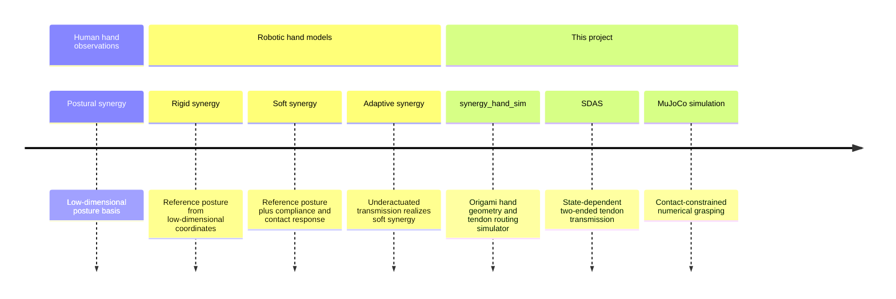
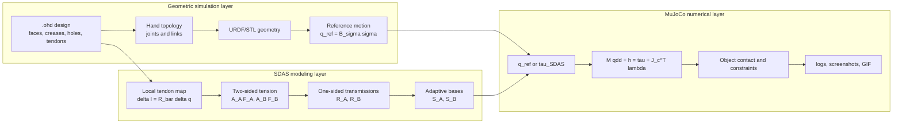

# English 5:5:4:5:1 poster content for synergy_hand_sim and SDAS

_Poster-ready English text with Chinese reading notes. The Chinese notes are for author-side interpretation and layout only; the poster body should use the English copy._

---

## Document use

中文说明：这份文档重新组织了海报叙事。它不假设观众知道 `synergy_hand_sim`、几何仿真、SDAS 或折纸手。它面向物理仿真课程的学生和老师：他们理解数值积分、约束和接触求解，但需要理解为什么要这样建模，以及模型怎样从机构结构进入仿真方程。

Recommended poster ratio:

| Section | Ratio | Approximate area | Main purpose |
|---|---:|---:|---|
| Problem Statement | 5 | 25% | Introduce hand synergies, synergy-based dexterous hands, origami differential behavior, and the need for a two-ended tendon model |
| Literature Review | 5 | 25% | Explain rigid synergy, soft synergy, adaptive synergy, and why SDAS is needed |
| Methodology | 4 | 20% | Explain both the geometric simulator and the MuJoCo numerical simulator |
| Experimental Result | 5 | 25% | Show representative geometry, free-motion, and contact-grasping results |
| Conclusion | 1 | 5% | Summarize the modeling contribution and simulation pipeline |

Recommended title:

**Modeling Adaptive Grasping in a Cable-Driven Origami Dexterous Hand**

Recommended subtitle:

**From posture synergies and origami tendon routing to SDAS-based MuJoCo contact simulation**

中文说明：标题不要从 “geometric synergy” 这类术语开头。先让听众知道对象是“索驱动折纸灵巧手”和“自适应抓取建模”，再在副标题中引出 SDAS 与 MuJoCo。

---

## Problem Statement

### Poster-ready English text

Human hand motion has many degrees of freedom, but grasping postures are not controlled as independent joint commands. A classical observation in hand neuroscience is that many hand shapes can be approximated by a small number of postural synergies: low-dimensional variables coordinate high-dimensional joint configurations.[^1] This idea is attractive for robotic dexterous hands because it suggests that a hand can be controlled by a few meaningful actuation coordinates rather than one actuator per joint.

The `synergy_hand_sim` project was developed around this idea for an origami-inspired dexterous hand. In the original geometric simulation, a hand design file defines faces, creases, joints, holes, actuators, and tendon routes. The simulator builds the hand topology, generates visual geometry, computes a synergy or transmission distribution, and maps a low-dimensional command into a reference joint configuration. This is useful for design iteration: it shows what the hand is intended to do before considering contact or dynamics.

However, the origami hand is not just a kinematic linkage. Its folds, compliant creases, and routed tendons create a differential-like underactuated mechanism: when one part of the hand is blocked by an object, tendon motion and joint compliance can redistribute motion to other joints. In a two-ended closed-loop tendon, pulling from side A and pulling from side B are not equivalent because tension propagates through different routed paths. A fixed transmission matrix can describe a reference motion, but it cannot explain this direction-dependent transmission. Therefore, this project models a two-ended tendon-driven synergy and connects it to numerical contact simulation.

### Chinese note

中文说明：Problem Statement 的重点是“从人手协同理论到为什么要建双端腱绳模型”。不要直接说“我把几何仿真升级为 MuJoCo”，因为观众还不知道几何仿真是什么。这里先解释：

- 人手姿态协同：低维变量控制高维关节。
- 基于协同的灵巧手：少量驱动器控制多个关节。
- `synergy_hand_sim` 几何仿真：从 `.ohd` 设计文件生成参考构型。
- 折纸差动特性：接触后运动会重分配。
- 双端闭环腱绳：A/B 两端拉动产生不同传动，因此需要 SDAS。

### Key equations to place

Postural synergy:

```math
q \approx S^{(k)}\sigma^{(k)}, \qquad k \ll n
```

Geometric reference generated by `synergy_hand_sim`:

```math
q_{\mathrm{ref}}(t) = B_{\sigma}\sigma(t)
```

Fixed transmission assumption:

```math
x = Rq, \qquad R=\mathrm{constant}
```

Need for a state-dependent transmission:

```math
R \rightarrow R(\mathcal{S})
```

### Recommended figures

| Figure | Suggested source | Purpose |
|---|---|---|
| Human-to-robot synergy concept | Redraw manually | Show low-dimensional `sigma` controlling high-dimensional `q` |
| `synergy_hand_sim` geometry design | `docs/figures/cad_ohd6_screenshot.png` | Introduce the project’s design interface and origami geometry |
| Origami differential-like tendon sketch | Redraw manually | Show folds, tendon routing, and motion redistribution after contact |

### Suggested figure caption

**Fig. 1. From hand synergy to origami tendon actuation.** Human-inspired postural synergy motivates low-dimensional control, while origami folds and routed tendons provide a mechanical way to distribute that control across multiple joints.

---

## Literature Review

### Poster-ready English text

The first layer of relevant work is rigid or postural synergy. In this view, a hand posture is approximated by a linear combination of a few basis shapes, often obtained from principal component analysis of human grasping postures. This gives a compact kinematic model, but the synergy command is essentially a posture prescription. It does not by itself explain how contact forces, compliance, or tendon routing change the realized grasp.

Soft synergy models address this limitation by treating the synergy command as a reference configuration rather than as a rigid final posture.[^2] When the hand contacts an object, the actual joint configuration can deviate from the reference due to compliance and contact forces. This is important for grasping because object shape should influence the final hand posture. Adaptive synergy models further connect this idea to underactuated robotic hands: a differential or tendon transmission maps a small number of actuator displacements into many joint coordinates, while passive compliance allows the hand to adapt during contact.[^3]

The Pisa/IIT SoftHand demonstrates that adaptive synergies can be implemented as a robust underactuated robotic hand with low-dimensional actuation and high-dimensional passive adaptation.[^4] These works motivate the core philosophy of this project: synergy is not only a control abstraction, but also a mechanical design principle. The gap is that the proposed origami hand uses a two-ended closed-loop tendon. Its effective transmission depends on which end is pulled and how tension propagates through the routed path. SDAS is proposed in this project to model that direction-dependent tendon transmission.

### Chinese note

中文说明：Literature Review 要围绕“为什么 SDAS 是必要的”组织，不要把 SDAS 写成文献里已有的模型。推荐逻辑：

1. Rigid/postural synergy：低维姿态模型，适合预成形。
2. Soft synergy：参考构型 + 接触柔顺，解释接触后偏离参考姿态。
3. Adaptive synergy：用差动或腱绳机构实现低维主动驱动和高维被动适应。
4. Pisa/IIT SoftHand：经典工程实现。
5. Gap：双端闭环腱绳的方向相关传动没有被固定 `R` 直接表达。
6. This work：提出 SDAS。

### Literature comparison table

| Concept | Modeling idea | Strength | Limitation for this project |
|---|---|---|---|
| Rigid/postural synergy | `q = S sigma` | Compact representation of hand posture | Mostly kinematic; contact is not part of the model |
| Soft synergy | `q_ref` plus compliance/contact response | Explains why the real hand shape can deviate from the reference | Does not directly specify a simple mechanical transmission |
| Adaptive synergy | Differential or tendon transmission `Rq=x` | Connects low-dimensional actuation to underactuated hands | Often assumes a fixed transmission matrix |
| Pisa/IIT SoftHand | Mechanical implementation of adaptive synergy | Robust low-dimensional actuation and passive adaptation | Different mechanical structure from the proposed origami tendon hand |
| SDAS, this project | Two one-sided transmissions `R_A`, `R_B` | Models direction-dependent closed-loop tendon transmission | Needs simulation to study contact-constrained grasping |

### Key equations to place

Rigid/postural synergy:

```math
q = S\sigma
```

Soft synergy equilibrium:

```math
\tau_e = K(q_r-q), \qquad J^T f_c = \tau_e
```

Adaptive synergy transmission:

```math
Rq=x, \qquad \tau=R^T f
```

Free-space adaptive synergy map:

```math
q = E^{-1}R^T(RE^{-1}R^T)^{-1}x
```

### Recommended figures

| Figure | Suggested source | Purpose |
|---|---|---|
| Literature timeline | Redraw manually or use Mermaid below | Show conceptual path from postural synergy to SDAS |
| Rigid vs soft synergy diagram | Redraw manually | Show prescribed posture vs contact-deformed posture |
| Adaptive synergy transmission | Redraw manually | Show actuator displacement, differential/tendon transmission, and joints |



### Suggested figure caption

**Fig. 2. Literature path and modeling gap.** Existing synergy models explain low-dimensional posture control and compliant adaptation. SDAS is introduced here to model the direction-dependent transmission of a two-ended closed-loop tendon in the proposed origami hand.

---

## Methodology

### Poster-ready English text

The methodology has two simulation layers. The first layer is the geometric simulator in `synergy_hand_sim`. A `.ohd` file defines the origami hand as a design graph: faces define rigid panels, creases define joints, holes and pulleys define tendon routing, and actuators define low-dimensional inputs. From this graph, the simulator builds the hand topology, exports URDF/STL geometry, computes tendon transmission or synergy distributions, and generates a reference joint trajectory:

```math
q_{\mathrm{ref}}(t)=B_{\sigma}\sigma(t).
```

This geometric layer is fast, interpretable, and useful for mechanism design. Its role is to answer: “What motion does the synergy model intend to produce?”

The second layer is the numerical dynamics simulator. Its purpose is to answer: “What motion is realized after time integration and contact constraints?” To connect the two layers, this project introduces SDAS. The model starts from local tendon geometry:

```math
\delta l = \bar{R}\delta q.
```

Because the closed-loop tendon can be pulled from side A or side B, the same segment receives different path-dependent tension weights:

```math
T_j^{(A)}=\alpha_j^{(A)}F_A,\qquad
T_j^{(B)}=\alpha_j^{(B)}F_B.
```

By virtual work, these two tension distributions define two one-sided transmissions:

```math
R_A=A_A^T\bar{R},\qquad R_B=A_B^T\bar{R},
```

and the joint torque becomes:

```math
\tau=R_A^T F_A+R_B^T F_B.
```

Combining these transmissions with joint stiffness and contact equilibrium yields:

```math
q=S_Ax_A+S_Bx_B+CJ^Tf_c.
```

The two bases `S_A` and `S_B` can be rewritten as a closing mode and a redistribution mode. The numerical simulator maps `.ohd` input sequences to `q_ref(t)` or `tau_SDAS(t)`, then MuJoCo advances the system:

```math
M(q)\ddot{q}+h(q,\dot{q})=\tau_{\mathrm{SDAS}}(t)+J_c(q)^T\lambda.
```

### Chinese note

中文说明：Methodology 需要同时讲几何仿真和数值仿真。你可以把它画成“两层仿真”：

- 几何仿真层：`.ohd -> geometry/topology -> transmission/synergy -> q_ref`。这是 `synergy_hand_sim` 原本的主要能力。
- SDAS 建模层：双端闭环腱绳 `R_A/R_B -> S_A/S_B`。
- MuJoCo 数值层：`q_ref/tau_SDAS -> dynamics + contact -> q(t), contact force, screenshots/GIF`。

物理仿真课程的听众已经理解 MuJoCo 方程，所以要强调的是：`tau_SDAS` 从哪里来，不是简单调参得到的，而是从腱绳路径、张力传播、虚功和 Schur 补推导出来的。

### Method flowchart



### Key equations to place

Local tendon geometry:

```math
\delta l=\bar{R}\delta q
```

Two-sided transmission:

```math
R_A=A_A^T\bar{R},\qquad R_B=A_B^T\bar{R}
```

SDAS adaptive shape:

```math
q=S_Ax_A+S_Bx_B+CJ^Tf_c
```

Closing and redistribution modes:

```math
q=(S_A+S_B)\sigma+(S_A-S_B)\sigma_f+CJ^Tf_c
```

MuJoCo dynamics:

```math
M(q)\ddot{q}+h(q,\dot{q})=\tau_{\mathrm{SDAS}}+J_c^T\lambda
```

### Recommended figures

| Figure | Suggested source | Purpose |
|---|---|---|
| Two-layer methodology diagram | Use Mermaid flowchart above, redraw in poster style | Main methodology figure |
| SDAS `R_A/R_B` distribution | `docs/figures/RA_RB_distribution.png` | Show A-side and B-side transmission asymmetry |
| SDAS flowchart | `docs/figures/sdas_flowchart.png` | Show derivation pipeline |
| GUI screenshot | `docs/figures/mujoco_sdas_gui.png` | Put in a small corner as user interface evidence |

### Suggested figure caption

**Fig. 3. Geometry-to-dynamics methodology.** The geometric simulator generates hand topology and reference motion from `.ohd` files. SDAS derives a physically interpretable tendon synergy, and MuJoCo solves the resulting contact-constrained dynamics.

---

## Experimental Result

### Poster-ready English text

The experiments are selected to show the full modeling chain rather than only a final rendered posture. First, the geometric design result demonstrates that `synergy_hand_sim` can define an origami hand from `.ohd` data, build hand geometry, and generate a reference motion from low-dimensional synergy inputs. This verifies the design-to-geometry part of the project.

Second, a free-space step-input experiment compares the geometric reference and the MuJoCo numerical state. The test uses a three-finger origami gripper with 9 joints and 2 SDAS drivers. The simulation runs for `1.2 s` with `600` steps. The MuJoCo state follows the reference trend but does not exactly match it, with an RMS joint error of `0.1848 rad` and a maximum absolute error of `0.5661 rad`. This difference is useful: it shows that the result is no longer just a displayed reference posture, but a time-integrated numerical state.

Third, contact-grasping experiments demonstrate why the numerical layer is needed. With a cylinder object, the simulator records `158` contact steps, up to `5` simultaneous contacts, and a maximum total contact force of `4.415`. With a scanned mug object imported from MuJoCo scanned assets, the simulator records `209` contact steps and up to `7` contacts. These demonstrations show that SDAS-derived actuation can be evaluated under object geometry and contact constraints.

### Chinese note

中文说明：Experimental Result 不要只放最终图片。最好按“链路验证”讲：

1. 几何设计/几何仿真图：证明 `synergy_hand_sim` 能从 `.ohd` 定义折纸手和协同参考。
2. 自由空间 step：证明几何参考和数值状态有可记录差异。
3. cylinder 抓取：简单几何物体，接触清楚。
4. scanned mug 抓取：外部物体资产，更像真实抓取 demo。

### Result table

| Demo | Purpose | Object | Steps | Contact steps | Max contacts | Max contact force | RMS error |
|---|---|---|---:|---:|---:|---:|---:|
| Free-space step | Geometry vs numerical state | None | 600 | 0 | 0 | 0.000 | 0.1848 rad |
| Cylinder grasp | Primitive contact grasp | Cylinder | 700 | 158 | 5 | 4.415 | 0.1816 rad |
| Scanned mug grasp | Imported asset grasp | Scanned mug | 700 | 209 | 7 | 0.623 | 0.1821 rad |

### Recommended result figures

| Priority | Figure | Path | Poster role |
|---:|---|---|---|
| 1 | Geometry design interface | `docs/figures/cad_ohd6_screenshot.png` | Introduce `synergy_hand_sim` as a design and geometry simulator |
| 2 | Geometry vs MuJoCo curve | `outputs/mujoco_sdas/step_demo/mujoco_sdas_step_geometry_vs_mujoco.png` | Show reference-vs-state difference |
| 3 | Cylinder final grasp | `outputs/mujoco_sdas/grasp_cylinder/mujoco_sdas_grasp_cylinder_t1.250.png` | Show clear contact with primitive object |
| 4 | Scanned mug final grasp | `outputs/mujoco_sdas/grasp_scanned_mug/mujoco_sdas_grasp_scanned_mug_t1.250.png` | Show imported object asset and richer contact |
| 5 | Scanned mug GIF | `outputs/mujoco_sdas/grasp_scanned_mug/mujoco_sdas_grasp_scanned_mug_video.gif` | Use as QR-linked supplemental material |

### Suggested figure captions

**Fig. 4a. Geometric design and simulation.** `synergy_hand_sim` represents the origami hand through faces, creases, joints, actuators, holes, and tendon paths, then generates reference motion from low-dimensional synergy inputs.

**Fig. 4b. Free-space numerical validation.** The MuJoCo state follows the SDAS-generated reference but differs due to numerical time integration and generalized-force tracking.

**Fig. 4c. Contact-grasping demos.** Cylinder and scanned-mug scenes show that the final hand posture is shaped by SDAS actuation, object geometry, and contact constraints.

---

## Conclusion

### Poster-ready English text

This project presents `synergy_hand_sim` as a complete modeling and simulation pipeline for an origami dexterous hand. The geometric layer converts `.ohd` designs into hand topology, visual geometry, tendon routing, and reference synergy motion. The proposed SDAS model explains why a two-ended closed-loop tendon generates direction-dependent transmissions and derives adaptive synergy bases from that mechanism. The MuJoCo layer then turns those model-derived inputs into numerical contact simulation, enabling reproducible grasping demos, logs, screenshots, and process GIFs.

### Chinese note

中文说明：Conclusion 只占 5%，不要再推公式。这里一句话收束：几何仿真负责设计和参考运动，SDAS 负责解释双端腱绳传动，MuJoCo 负责接触数值求解。

### One-line conclusion

**The contribution is not only a MuJoCo demo: it is a full chain from origami hand design, to geometric synergy simulation, to SDAS tendon modeling, to contact-aware numerical grasping.**

---

## Final poster formula shortlist

中文说明：最终海报建议只放 6 到 8 个公式。下面这些公式能完整讲清楚模型链路。

| Priority | Equation | Meaning |
|---:|---|---|
| 1 | `q approx S^(k) sigma^(k)` | Human-inspired postural synergy |
| 2 | `q_ref = B_sigma sigma` | Geometric simulation reference motion |
| 3 | `delta l = R_bar delta q` | Local tendon geometry |
| 4 | `R_A=A_A^T R_bar, R_B=A_B^T R_bar` | Two-ended tendon transmission |
| 5 | `tau=R_A^T F_A + R_B^T F_B` | Virtual-work torque mapping |
| 6 | `q=S_A x_A + S_B x_B + C J^T f_c` | SDAS adaptive synergy with contact |
| 7 | `q=(S_A+S_B)sigma+(S_A-S_B)sigma_f+CJ^T f_c` | Closing and redistribution modes |
| 8 | `M qddot + h = tau_SDAS + J_c^T lambda` | MuJoCo numerical contact dynamics |

---

## Final poster layout suggestion

```text
+--------------------------------------------------------------------------------+
| Title: Modeling Adaptive Grasping in a Cable-Driven Origami Dexterous Hand       |
| Subtitle: From posture synergies and origami tendon routing to SDAS-MuJoCo       |
+---------------------------+---------------------------+------------------------+
| Problem Statement         | Literature Review         | Methodology            |
| - Human postural synergy  | - Rigid synergy           | - .ohd geometry layer  |
| - Synergy-based hands     | - Soft synergy            | - SDAS derivation      |
| - Origami differential    | - Adaptive synergy        | - MuJoCo contact solve |
| - Why two-ended tendon    | - Gap: fixed R            | - Main flowchart       |
+---------------------------+---------------------------+------------------------+
| Experimental Result                                                             |
| CAD/geometric figure | geometry-vs-MuJoCo curve | cylinder | scanned mug | table |
+--------------------------------------------------------------------------------+
| Conclusion: design -> geometry simulation -> SDAS model -> MuJoCo contact demos |
+--------------------------------------------------------------------------------+
```

中文说明：这个布局仍然保持 5:5:4:5:1。Problem 和 Literature 面积较大，因为你需要先教育听众；Methodology 稍小但公式密度高；Experimental Result 用图说话；Conclusion 一句话收束。

---

## References for poster notes

中文说明：海报上如果空间不够，可以只保留作者年份，不放完整 URL；答辩或讲解材料里建议保留这些引用。

[^1]: M. Santello, M. Flanders, and J. F. Soechting, “Postural hand synergies for tool use,” _Journal of Neuroscience_, 1998. PubMed: https://pubmed.ncbi.nlm.nih.gov/9822764/

[^2]: A. Bicchi, M. Gabiccini, and M. Santello, “Modelling natural and artificial hands with synergies,” _Philosophical Transactions of the Royal Society B_, 2011. Source page: https://asu.elsevierpure.com/en/publications/modelling-natural-and-artificial-hands-with-synergies

[^3]: The adaptive synergy derivation used in this project follows the local project theory notes in `docs/SDAS.md`, Section 2.2.

[^4]: M. G. Catalano, G. Grioli, E. Farnioli, A. Serio, C. Piazza, and A. Bicchi, “Adaptive Synergies for the Design and Control of the Pisa/IIT SoftHand,” _International Journal of Robotics Research_, 2014. DOI and publication page: https://www.centropiaggio.unipi.it/publications/adaptive-synergies-design-and-control-pisaiit-softhand.html

[^5]: E. Todorov, T. Erez, and Y. Tassa, “MuJoCo: A physics engine for model-based control,” IEEE/RSJ IROS, 2012. DBLP: https://dblp.uni-trier.de/rec/conf/iros/TodorovET12.html
