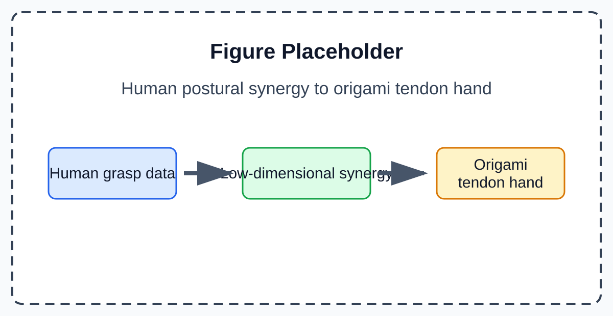
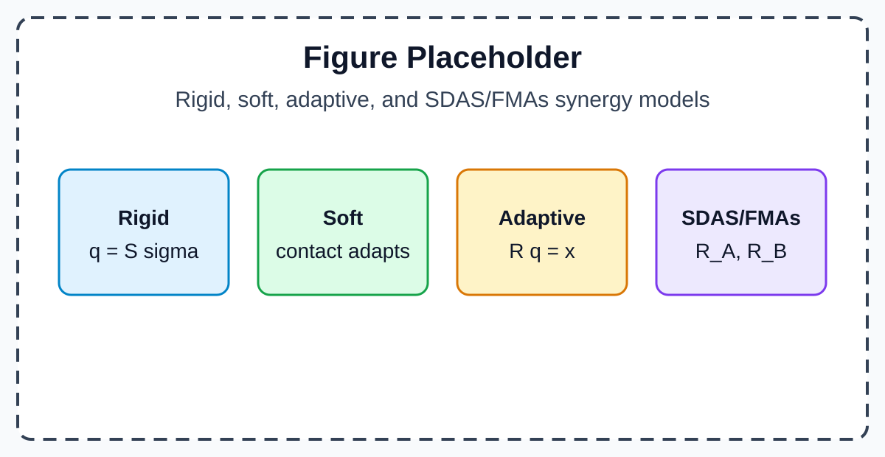
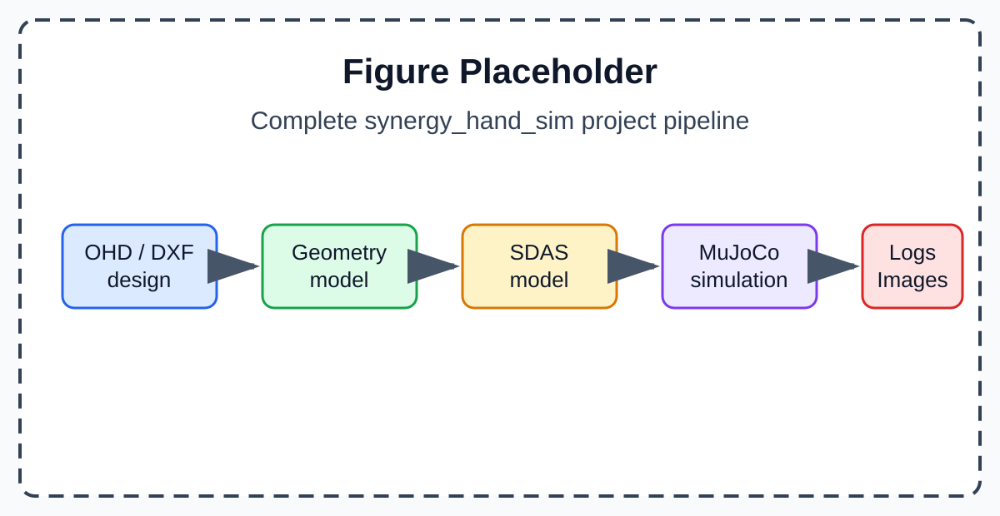
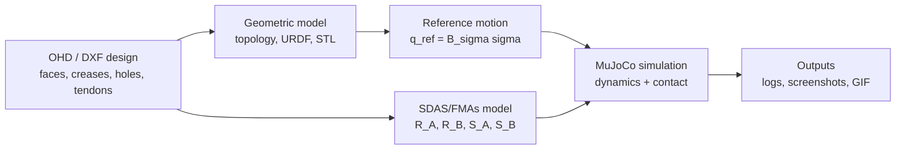
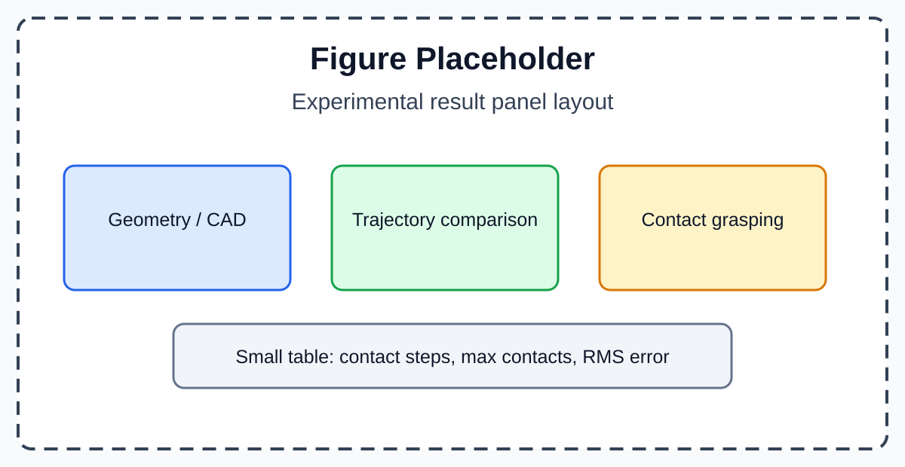
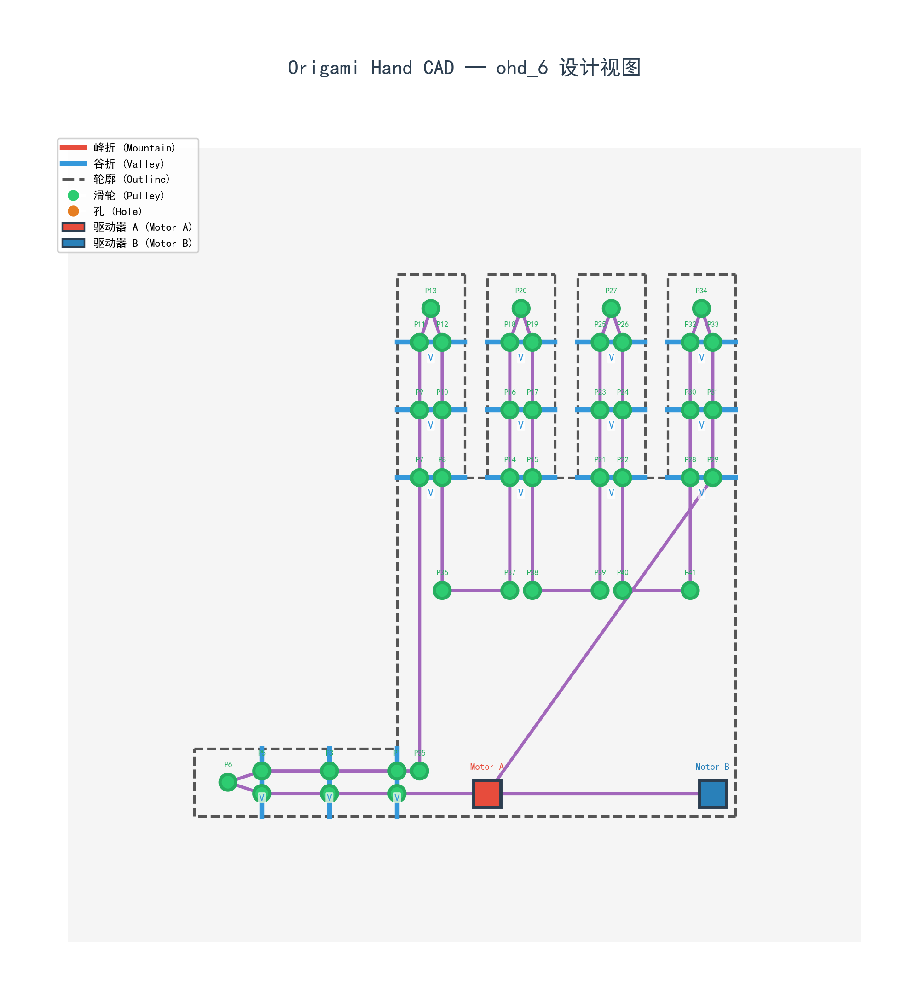

# Modeling Adaptive Grasping in a Cable-Driven Origami Dexterous Hand

_Poster-style Markdown draft for presenting the full `synergy_hand_sim` project from the beginning. Poster body text is written in English; Chinese notes are only for the author while editing the poster._

---

## Poster Layout

> 中文说明：这份文档不是报告，而是按海报区块来写。每个部分都给出可以直接放上海报的英文正文、可渲染公式、图片占位和图注。建议比例仍然是 5:5:4:5:1。

| Poster block | Ratio | What the audience should understand |
|---|---:|---|
| Problem Statement | 5 | Why hand synergy matters, why origami hands behave like differential underactuated mechanisms, and why a two-ended tendon model is needed |
| Literature Review | 5 | What rigid, soft, adaptive, and SDAS/FMAs synergy models each contribute |
| Methodology | 4 | How the project goes from `.ohd` design files to geometric simulation, SDAS modeling, and MuJoCo contact simulation |
| Experimental Results | 5 | What representative project outputs demonstrate the modeling pipeline |
| Conclusion | 1 | What the whole project contributes |

Recommended poster subtitle:

**From posture synergies and origami tendon routing to SDAS/FMAs-based MuJoCo contact simulation**

---

## Problem Statement

### Poster-ready English text

Human hands have many joints, but grasping is not usually controlled as a collection of independent joint commands. A useful abstraction is **postural synergy**: a high-dimensional hand posture can be approximated by a small number of coordinated variables. This motivates synergy-based dexterous hands, where a few actuators coordinate many joints through mechanical transmission rather than one motor per joint.

The `synergy_hand_sim` project is built to study this idea in an origami-inspired dexterous hand. A design file describes the hand as a physical layout: origami faces, creases, joints, holes, actuators, and tendon routes. The project then builds the hand topology, generates visual geometry, computes tendon transmission and synergy distributions, and maps low-dimensional actuation commands into joint-space motion.

The key modeling challenge is that this origami hand is not a fully actuated rigid linkage. Its folds, compliant creases, and routed tendons create a differential-like underactuated mechanism. When one part of the hand is constrained by an object, tendon motion and joint compliance can redistribute motion to other joints. For a two-ended closed-loop tendon, pulling from side A and pulling from side B are not equivalent, because tension propagates through different routed paths. Therefore, the project needs a tendon-driven synergy model that explains direction-dependent transmission and can be connected to numerical contact simulation.

### Core formulas

Human-inspired postural synergy:

$$
q \approx S^{(k)}\sigma^{(k)}, \qquad k \ll n
$$

Project-level geometric reference:

$$
q_{\mathrm{ref}}(t)=B_{\sigma}\sigma(t)
$$

Fixed transmission assumption and the modeling gap:

$$
x=Rq, \qquad R=\mathrm{constant}
$$

$$
R \rightarrow R(\mathcal{S})
$$

> 中文说明：这里的重点不是“软件升级”，而是“为什么这个项目要存在”。听众需要先知道：协同是什么，折纸手为什么自然适合协同，为什么双端闭环腱绳不能用一个固定传动矩阵解释。

### Figure placeholder

**Fig. 1. From hand synergy to an origami tendon hand.** Human postural synergy motivates low-dimensional control; origami folds and routed tendons provide a mechanical way to distribute that control across many joints.

---

## Literature Review

### Poster-ready English text

Synergy models can be understood as a sequence of increasingly physical descriptions. **Rigid synergy** treats the hand as a posture space: a low-dimensional command directly generates a high-dimensional hand shape. This is compact and useful for pre-shaping, but it does not explain contact response.

**Soft synergy** keeps the low-dimensional reference but allows the real hand to deviate from it under compliance and contact. This turns a synergy command from a rigid target into a compliant reference. **Adaptive synergy** then moves the idea into mechanical implementation: a tendon or differential transmission maps a few actuator displacements into many joint coordinates, while passive joint compliance allows adaptation during contact.

The SDAS/FMAs model proposed in this project extends the adaptive-synergy idea to a two-ended closed-loop tendon. Instead of assuming one fixed transmission matrix, it derives two one-sided transmissions from the routed tendon path. This is necessary because pulling from the two ends produces different tension distributions and therefore different joint torque directions.

### Model comparison formula cards

Rigid synergy:

$$
q=S\sigma
$$

Core idea: a high-dimensional hand posture is approximated by fixed low-dimensional posture coordinates.

Soft synergy:

$$
q_r=S\sigma
$$

$$
J^T f_c=K(q_r-q)
$$

Core idea: the synergy command defines a reference posture, while compliance and contact shape the realized posture.

Adaptive synergy:

$$
Rq=x
$$

$$
q=E^{-1}R^T(RE^{-1}R^T)^{-1}x
$$

Core idea: a mechanical transmission realizes synergy by mapping a few actuator displacements into many joint coordinates.

SDAS/FMAs:

$$
R_A=A_A^T\bar{R}, \qquad R_B=A_B^T\bar{R}
$$

$$
\tau=R_A^T F_A+R_B^T F_B
$$

Core idea: a two-ended closed-loop tendon produces direction-dependent transmissions, so the synergy basis is derived from two one-sided tendon paths.

> 中文说明：这部分要像“模型谱系”，不是长篇综述。Rigid、soft、adaptive 是已有思想；SDAS/FMAs 是本项目提出的模型，用来解释双端闭环腱绳的方向相关传动。

### Figure placeholder

**Fig. 2. Four synergy models.** Rigid synergy describes posture compression, soft synergy adds compliance and contact, adaptive synergy gives mechanical realization, and SDAS/FMAs derives two one-sided transmissions for a two-ended tendon.

---

## Methodology

### Poster-ready English text

The project is organized as three connected modeling layers. The first layer is **design and geometric simulation**. A `.ohd` file stores the origami hand design: panels, creases, joints, tendon holes, pulleys, actuators, and routed tendon sequences. From this description, the software reconstructs the hand topology, exports visual geometry, and computes how a low-dimensional command should move the joints. This layer answers the design question: what motion should the designed tendon routing produce?

The second layer is **SDAS/FMAs tendon modeling**. The local tendon geometry first maps joint displacement to tendon segment length change. Because the tendon is driven from two ends, the A-side and B-side pulls generate different tension distributions along the route. Using virtual work, those two tension distributions become two one-sided transmission vectors. A Schur-complement formulation then converts the two motor-side constraints into adaptive synergy bases.

The third layer is **MuJoCo numerical simulation**. The SDAS/FMAs model provides a joint-space reference or generalized force input. MuJoCo advances the hand-object system through numerical dynamics and contact constraints. This layer answers the physical simulation question: how does the hand actually move when time integration and object contact are solved numerically?

### Geometry layer formulas

Low-dimensional command to reference motion:

$$
q_{\mathrm{ref}}(t)=B_{\sigma}\sigma(t)
$$

Transmission-based geometric interpretation:

$$
Rq=x
$$

### SDAS/FMAs derivation formulas

Local tendon geometry:

$$
\delta l=\bar{R}\delta q
$$

Direction-dependent tension propagation:

$$
T_j^{(A)}=\alpha_j^{(A)}F_A,
\qquad
T_j^{(B)}=\alpha_j^{(B)}F_B
$$

One-sided transmissions:

$$
R_A=A_A^T\bar{R},
\qquad
R_B=A_B^T\bar{R}
$$

Virtual-work torque mapping:

$$
\tau=R_A^T F_A+R_B^T F_B
$$

Schur-complement adaptive synergy:

$$
q=S_Ax_A+S_Bx_B+CJ^T f_c
$$

Common and differential modes:

$$
\sigma=\frac{x_A+x_B}{2},
\qquad
\sigma_f=\frac{x_A-x_B}{2}
$$

$$
q=(S_A+S_B)\sigma+(S_A-S_B)\sigma_f+CJ^T f_c
$$

### Numerical simulation formulas

SDAS/FMAs input to joint-space control:

$$
u(t)\rightarrow q_{\mathrm{ref}}(t)\rightarrow \tau_{\mathrm{SDAS}}(t)
$$

MuJoCo contact dynamics:

$$
M(q)\ddot{q}+h(q,\dot{q})
=
\tau_{\mathrm{SDAS}}(t)+J_c(q)^T\lambda
$$

Logged contact metric:

$$
F_{\mathrm{contact,total}}(t)
=
\sum_{i=1}^{n_c(t)}\|f_{c,i}(t)\|
$$

> 中文说明：Methodology 一定要讲清楚“几何仿真”和“数值仿真”分别干什么。几何仿真不是旧东西，它是整个项目的第一层建模：从设计文件到参考运动。数值仿真是第三层：从模型输入到接触约束下的实际状态。SDAS/FMAs 是中间桥梁。

### Project pipeline placeholder

**Fig. 3. Complete project pipeline.** The project starts from `.ohd`/DXF design data, constructs geometric hand models, derives SDAS/FMAs tendon synergies, runs MuJoCo contact simulation, and outputs logs, screenshots, and process animations.

### Suggested method figure to replace the placeholder

---

## Experimental Results

### Poster-ready English text

The experimental results are selected to show the full project rather than a single final image. First, the geometric design view demonstrates that `synergy_hand_sim` can represent an origami hand through faces, creases, joints, holes, actuators, and tendon paths. This verifies the design-to-geometry part of the project.

Second, a free-space step-input test compares the geometric reference and the MuJoCo numerical state. The test uses a three-finger origami gripper with 9 joints and 2 SDAS/FMAs drivers. The simulation runs for `1.2 s` and `600` steps. The numerical state follows the reference trend but does not exactly coincide with it, giving an RMS joint error of `0.1848 rad` and a maximum absolute error of `0.5661 rad`. This shows the distinction between reference motion and numerically integrated motion.

Third, contact-grasping scenes show why the numerical layer is useful. In the cylinder grasp, the simulation records `158` contact steps, up to `5` simultaneous contacts, and a maximum total contact force of `4.415`. In the scanned mug grasp, the simulation records `209` contact steps and up to `7` simultaneous contacts. These results show that the SDAS/FMAs actuation model can be evaluated under object geometry and contact constraints.

### Result figure layout placeholder

**Fig. 4. Suggested result panel.** Use one geometric design image, one reference-vs-numerical trajectory plot, two contact-grasp screenshots, and a small quantitative table.

### Recommended real figures

Geometry and interface:

**Fig. 5a. Geometric design layer.** The hand design is represented using faces, creases, holes, actuators, and tendon paths.

Free-space trajectory comparison:

**Fig. 5b. Reference motion versus numerical state.** The geometric/SDAS reference and MuJoCo state are logged separately, making the simulation error and dynamic response visible.

Cylinder grasp:

**Fig. 5c. Primitive-object contact demo.** The cylinder grasp provides a clear contact scene for evaluating SDAS/FMAs actuation under MuJoCo constraints.

Scanned mug grasp:

**Fig. 5d. Imported-object contact demo.** The scanned mug example demonstrates that external MuJoCo object assets can be integrated into the same simulation pipeline.

### Quantitative result table

| Demo | Purpose | Object | Steps | Contact steps | Max contacts | Max contact force | RMS error |
|---|---|---|---:|---:|---:|---:|---:|
| Free-space step | Reference vs numerical state | None | 600 | 0 | 0 | 0.000 | 0.1848 rad |
| Cylinder grasp | Primitive contact test | Cylinder | 700 | 158 | 5 | 4.415 | 0.1816 rad |
| Scanned mug grasp | Imported-object contact test | Scanned mug | 700 | 209 | 7 | 0.623 | 0.1821 rad |

> 中文说明：结果区不要只放“最后姿态图”。最好同时展示：设计图、轨迹对比图、两个抓取结果图和一个小表格。这样听众能看到这是一个完整项目：设计、建模、仿真、输出。

---

## Conclusion

### Poster-ready English text

The project presents a complete modeling and simulation pipeline for an origami-inspired dexterous hand. The geometric layer turns `.ohd` design files into hand topology, visual geometry, tendon routing, and reference synergy motion. The proposed SDAS/FMAs model explains the direction-dependent transmission of a two-ended closed-loop tendon. The MuJoCo layer turns those model-derived inputs into numerical contact simulation, producing reproducible trajectories, contact logs, screenshots, and grasping demonstrations.

### One-line conclusion

**The contribution is a full chain from origami hand design, to geometric synergy modeling, to SDAS/FMAs tendon transmission, to MuJoCo contact-aware grasping simulation.**

> 中文说明：Conclusion 不要再展开公式。它只需要把整个项目的四个关键词收束起来：design、geometry、SDAS/FMAs、MuJoCo contact simulation。

---

## Final Poster Formula Set

> 中文说明：如果海报空间有限，保留下面 6 个公式即可。它们能从理论、几何层、SDAS 层和数值层完整串起来。

1. Postural synergy:

$$
q \approx S^{(k)}\sigma^{(k)}
$$

2. Geometric reference:

$$
q_{\mathrm{ref}}(t)=B_{\sigma}\sigma(t)
$$

3. Local tendon geometry:

$$
\delta l=\bar{R}\delta q
$$

4. Two-ended tendon transmission:

$$
R_A=A_A^T\bar{R},\qquad R_B=A_B^T\bar{R}
$$

5. SDAS/FMAs adaptive shape:

$$
q=S_Ax_A+S_Bx_B+CJ^Tf_c
$$

6. Numerical contact dynamics:

$$
M(q)\ddot{q}+h(q,\dot{q})
=
\tau_{\mathrm{SDAS}}(t)+J_c(q)^T\lambda
$$

---

## References

> 中文说明：海报上可以只放作者年份，完整引用可以放在汇报稿或补充页。

1. M. Santello, M. Flanders, and J. F. Soechting, “Postural hand synergies for tool use,” _Journal of Neuroscience_, 1998.
2. A. Bicchi, M. Gabiccini, and M. Santello, “Modelling natural and artificial hands with synergies,” _Philosophical Transactions of the Royal Society B_, 2011.
3. M. G. Catalano, G. Grioli, E. Farnioli, A. Serio, C. Piazza, and A. Bicchi, “Adaptive Synergies for the Design and Control of the Pisa/IIT SoftHand,” _International Journal of Robotics Research_, 2014.
4. E. Todorov, T. Erez, and Y. Tassa, “MuJoCo: A physics engine for model-based control,” IEEE/RSJ IROS, 2012.
