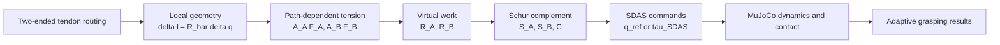
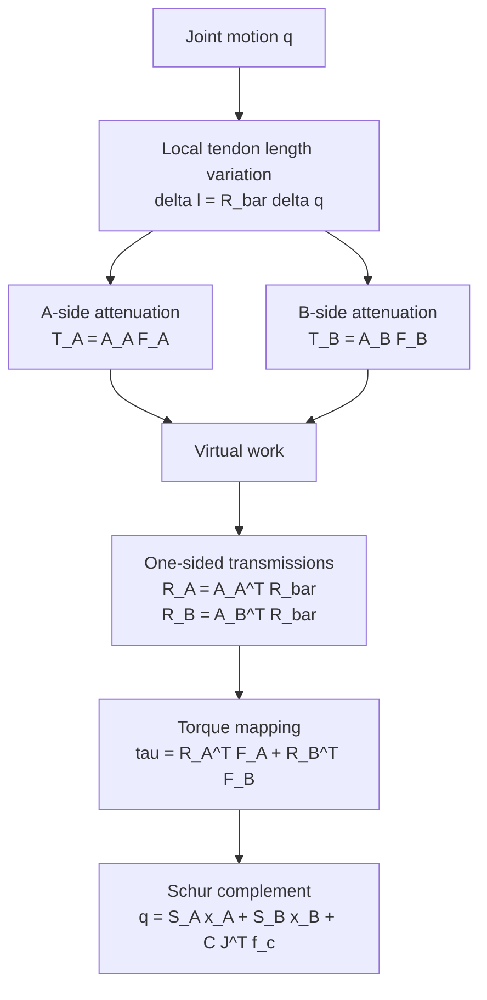

# SDAS/FMAs 模型推导与数值仿真映射说明

> 用途：本文件用于补充和修正海报内容。SDAS，也就是早期文档中写作 FMAS 的模型，是本项目首次提出的建模框架；它不应被写成已有文献模型。海报中的文献综述应当把 Pisa/IIT SoftHand、adaptive synergy、augmented adaptive synergy 等工作作为动机和对照，然后在 methodology 中重点解释 SDAS/FMAs 的推导、关键公式，以及它如何进入 MuJoCo 数值仿真。

## A. English Poster Text for a Physical Simulation Audience

> 中文说明：这一节是给海报直接使用的英文正文。目标听众是物理仿真课程的学生和老师，他们理解数值积分、约束求解和接触动力学，因此正文不需要反复解释 MuJoCo 是什么，而要解释为什么需要 SDAS、SDAS 怎样从机构传动推导出来，以及它怎样变成仿真方程中的输入。

### A.1 Recommended Title

**Modeling Adaptive Grasping in a Cable-Driven Origami Dexterous Hand**

Recommended subtitle:

**Introducing SDAS: a state-dependent tendon transmission model connected to MuJoCo contact simulation**

Alternative title if the poster should emphasize the model more strongly:

**SDAS: A State-Dependent Tendon Synergy Model for Origami Dexterous Hand Grasping**

中文说明：不要用过于术语化的“几何协同到接触仿真”作为主标题。那类标题默认听众已经知道 geometric synergy 和 SDAS，而课程听众更需要先知道研究对象和建模贡献。

### A.2 One-Sentence Contribution

**This project proposes SDAS, a state-dependent adaptive synergy model that derives grasping synergies from two-ended closed-loop tendon transmission, and connects the model to MuJoCo simulation so that joint motion, object contact, and adaptive grasping can be solved in one numerical framework.**

中文说明：这句话可以放在标题下方或海报摘要位置。重点是 “proposes SDAS”，不是 “uses SDAS from the literature”。

### A.3 Problem Statement

Origami-inspired dexterous hands can produce multi-joint grasping motion with a small number of actuators. The difficulty is that the motion is not only a geometric posture-generation problem. When the hand touches an object, the realized joint configuration is determined by tendon transmission, structural compliance, contact constraints, and numerical time integration. A fixed synergy matrix can prescribe a reference posture, but it cannot explain why a two-ended closed-loop tendon produces different joint torque distributions when pulled from different directions.

The modeling problem is therefore to derive a physically interpretable low-dimensional actuation model for the proposed hand. The model must start from tendon routing and joint geometry, explain how two motor-side inputs generate different transmission directions, and provide a control-space representation that can be passed to a MuJoCo contact simulation.

Recommended short version for a tight poster:

**A fixed synergy matrix can generate a reference posture, but it cannot explain the direction-dependent transmission of a two-ended closed-loop tendon. SDAS addresses this gap by deriving the synergy basis from tendon routing, path-dependent tension propagation, joint stiffness, and contact equilibrium.**

中文说明：problem statement 要避免写成“软件升级任务”。对课程听众来说，真正的问题是“为什么这个机构不能直接用固定传动矩阵建模”。

### A.4 Literature Review

Postural synergy studies show that high-dimensional hand configurations can often be represented by a small number of coordinated variables. Soft synergy and adaptive synergy models extend this idea by treating the synergy command as a reference configuration rather than a rigid command: under contact, the actual hand shape can deviate from the reference due to compliance and external constraints. The Pisa/IIT SoftHand line of work demonstrates how low-dimensional actuation and high-dimensional passive adaptation can be implemented in robotic hands.

These works motivate the use of low-dimensional actuation, transmission matrices, and compliance-based adaptation. However, the proposed origami hand has a specific transmission structure: a closed-loop tendon can be pulled from two ends, and the effective tension distribution depends on the direction of propagation along the routed path. Existing fixed-transmission synergy models do not directly describe this direction-dependent tendon behavior. This motivates the proposed State-Dependent Adaptive Synergy (SDAS) model.

Recommended literature transition sentence:

**The literature motivates the use of synergy coordinates; SDAS is the contribution of this project that makes those coordinates physically meaningful for a two-ended closed-loop tendon system.**

中文说明：文献综述不要把 SDAS 写成 SoftHand 论文里的模型。正确结构是：existing work motivates low-dimensional adaptive control -> gap in two-ended tendon routing -> this work proposes SDAS。

### A.5 Methodology Overview

The SDAS derivation has four steps. First, local tendon length changes are computed from joint motion. Second, pulling from the A and B sides creates two different path-dependent tension distributions along the tendon. Third, virtual work maps these distributed tendon tensions to two one-sided joint transmission vectors. Fourth, joint stiffness and contact equilibrium are combined into a Schur-complement solution, producing the adaptive synergy basis used by the simulator.

In the numerical implementation, the `.ohd` file provides the hand model, actuator definitions, time-varying input sequence, distribution type, and grasping object. SDAS maps the input sequence to a joint-space reference or generalized force. MuJoCo then solves the resulting dynamics and contact constraints, while logs and rendered frames record the difference between the free-space reference and the contact-constrained motion.

中文说明：methodology 的中心应该是一张“推导链路图”，而不是 GUI 截图。GUI 可以放在角落作为接口说明，核心图要讲模型。

### A.6 SDAS Derivation Text

Let the hand have `n` generalized joint coordinates:

```math
q \in \mathbb{R}^{n}.
```

The closed-loop tendon passes through `m` routing or guiding elements. The local tendon length variation is written as:

```math
\delta l = \bar{R}\delta q,
\quad
\bar{R}\in\mathbb{R}^{m\times n}.
```

Here, `\bar{R}` is not yet the final actuator-to-joint transmission. It is a local geometric map: each row describes how a small joint displacement changes one routed tendon segment.

When the tendon is pulled from side A, the tension arriving at segment `j` is modeled as:

```math
T_j^{(A)}
=
\alpha_j^{(A)}F_A,
\quad
\alpha_j^{(A)}
=
\exp\left(
-\sum_{k\in P_A(j)}\beta_k
\right).
```

When the same tendon is pulled from side B:

```math
T_j^{(B)}
=
\alpha_j^{(B)}F_B,
\quad
\alpha_j^{(B)}
=
\exp\left(
-\sum_{k\in P_B(j)}\beta_k
\right).
```

Because the paths `P_A(j)` and `P_B(j)` are generally different, the two attenuation factors are generally different:

```math
\alpha_j^{(A)} \neq \alpha_j^{(B)}.
```

Therefore, the two motor sides create two different distributed tension fields:

```math
T = A_A F_A + A_B F_B.
```

By virtual work:

```math
\tau = \bar{R}^{T}T.
```

Substituting the two tension fields gives:

```math
\tau
=
\bar{R}^{T}A_A F_A
+
\bar{R}^{T}A_B F_B.
```

Define the one-sided transmission vectors:

```math
R_A = A_A^{T}\bar{R},
\quad
R_B = A_B^{T}\bar{R}.
```

Then the joint torque becomes:

```math
\tau
=
R_A^{T}F_A
+
R_B^{T}F_B.
```

This is the central modeling step of SDAS. The model does not prescribe two arbitrary synergy directions; it derives them from the geometry of the routed tendon and the direction-dependent propagation of tension.

中文说明：这一段可以拆成海报上的 3 个公式框：local geometry, path-dependent tension, virtual-work torque mapping。

### A.7 Why the Model Is State-Dependent

In a fixed-transmission model, the actuator-to-joint map is assumed constant:

```math
x = Rq,
\quad
R = \mathrm{constant}.
```

In the proposed hand, the effective map depends on which side is pulling and how tension propagates through the routed tendon. The model is therefore better described as:

```math
R \rightarrow R(S),
```

where `S` denotes the internal transmission state, including routing direction, segment-wise attenuation, and contact-dependent load distribution. SDAS makes this state dependence computable by replacing one fixed transmission vector with two physically derived one-sided transmissions:

```math
R_A,\quad R_B.
```

中文说明：如果海报空间有限，这一节可以用一张 “fixed R vs. SDAS R_A/R_B” 对比图表达。

### A.8 From Transmission to Adaptive Synergy

The motor-side virtual displacements satisfy:

```math
\begin{bmatrix}
x_A\\
x_B
\end{bmatrix}
=
\begin{bmatrix}
R_A\\
R_B
\end{bmatrix}
q.
```

Let `E` be the equivalent joint stiffness matrix and `J^T f_c` be the generalized contact wrench. The quasi-static equilibrium can be written as:

```math
J^{T}f_c
=
R_A^{T}F_A
+
R_B^{T}F_B
-
E q.
```

Combining equilibrium with the two motor displacement constraints gives a block system:

```math
\begin{bmatrix}
-E & R_A^{T} & R_B^{T} \\
R_A & 0 & 0 \\
R_B & 0 & 0
\end{bmatrix}
\begin{bmatrix}
q\\
F_A\\
F_B
\end{bmatrix}
=
\begin{bmatrix}
J^{T}f_c\\
x_A\\
x_B
\end{bmatrix}.
```

Solving this system by Schur complement gives:

```math
q
=
S_A x_A
+
S_B x_B
+
CJ^{T}f_c.
```

The matrices `S_A` and `S_B` are the SDAS adaptive synergy bases. The term `CJ^T f_c` explains why contact changes the realized hand posture: the final configuration is not only a commanded shape, but the result of actuation, compliance, and contact.

中文说明：这是对物理仿真老师最重要的一段。它说明 SDAS 不是调参矩阵，而是由约束、刚度和虚功推导出的线性代数结构。

### A.9 Closing and Redistribution Modes

The two motor-side displacements can be rewritten as common and differential inputs:

```math
\sigma
=
\frac{x_A+x_B}{2},
\quad
\sigma_f
=
\frac{x_A-x_B}{2}.
```

Substituting into the Schur-complement solution gives:

```math
q
=
(S_A+S_B)\sigma
+
(S_A-S_B)\sigma_f
+
CJ^{T}f_c.
```

This gives two interpretable modes:

```math
S_{\mathrm{close}} = S_A+S_B,
\quad
S_{\mathrm{redistribute}} = S_A-S_B.
```

`S_close` produces the global closing trend, while `S_redistribute` changes how motion is distributed across joints. This is why the hand can use low-dimensional actuation while still adapting its shape during contact.

中文说明：这一段适合放在 methodology 的末尾，帮助听众把数学式子和“自适应抓取”联系起来。

### A.10 From SDAS to MuJoCo

SDAS provides the actuator-to-joint mapping, but it does not replace the physical simulator. Instead, it supplies MuJoCo with a physically motivated joint-space input:

```math
u(t)
\rightarrow
q_{\mathrm{ref}}(t)
\rightarrow
\tau_{\mathrm{SDAS}}(t).
```

For example, with common and differential commands:

```math
q_{\mathrm{ref}}(t)
=
S_{\mathrm{close}}\sigma(t)
+
S_{\mathrm{redistribute}}\sigma_f(t).
```

The simulation then advances the system using MuJoCo dynamics:

```math
M(q)\ddot{q}
+
h(q,\dot{q})
=
\tau_{\mathrm{SDAS}}(t)
+
J_c(q)^{T}\lambda.
```

The important modeling separation is:

- SDAS explains how actuator commands become joint-space actuation.
- MuJoCo solves time integration, constraints, and contact response.
- The experimental logs compare the SDAS free-space reference with the contact-constrained numerical state.

中文说明：这里不要把重点写成“MuJoCo 求解器很强”。听众知道这个。重点是 SDAS 怎样提供 `tau_SDAS` 或 `q_ref`。

### A.11 Experimental Result Text

The simulator was tested with a step-input free-space motion and several object-grasping scenes. In free space, the MuJoCo trajectory follows the SDAS-generated reference but does not exactly coincide with it, because the system is advanced through numerical dynamics rather than directly displaying the reference posture. In contact scenes, the deviation becomes physically meaningful: the object reaction and contact constraints change the realized joint configuration.

The cylinder and scanned-mug demonstrations are the clearest poster examples. The cylinder scene shows stable contact formation with a simple primitive object, while the scanned-mug scene demonstrates that imported MuJoCo object assets can be integrated into the same SDAS-driven pipeline. Together, these results show that the proposed model can be used not only to generate a hand posture, but also to simulate how the hand adapts when the grasp is constrained by object geometry.

Recommended short result caption:

**The final grasp posture is not a manually prescribed pose. It emerges from SDAS-derived actuation, joint compliance, object geometry, and MuJoCo contact constraints.**

### A.12 Conclusion

This project proposes SDAS, a state-dependent adaptive synergy model for a two-ended closed-loop tendon-driven origami hand. The model starts from local tendon geometry, derives direction-dependent one-sided transmissions, and uses a Schur-complement formulation to obtain adaptive synergy bases. These bases are then connected to MuJoCo as joint-space references or generalized forces for contact simulation. The resulting framework links original mechanism modeling with reproducible numerical experiments, including time-varying `.ohd` inputs, grasping objects, logs, screenshots, and process GIFs.

Recommended one-line conclusion:

**SDAS turns the tendon routing of an origami hand into a physically interpretable synergy basis, and MuJoCo turns that basis into contact-aware grasping simulation.**

### A.13 Key Formula Set for the Poster

中文说明：如果海报空间有限，建议只放下面 6 组公式。它们比软件接口更重要。

1. Local tendon geometry:

```math
\delta l = \bar{R}\delta q
```

2. Direction-dependent tendon tension:

```math
T_j^{(A)} = \alpha_j^{(A)}F_A,
\quad
T_j^{(B)} = \alpha_j^{(B)}F_B
```

3. One-sided transmissions:

```math
R_A = A_A^{T}\bar{R},
\quad
R_B = A_B^{T}\bar{R}
```

4. Joint torque by virtual work:

```math
\tau
=
R_A^{T}F_A
+
R_B^{T}F_B
```

5. SDAS adaptive synergy:

```math
q
=
S_A x_A
+
S_B x_B
+
CJ^{T}f_c
```

6. Numerical simulation:

```math
M(q)\ddot{q}
+
h(q,\dot{q})
=
\tau_{\mathrm{SDAS}}(t)
+
J_c(q)^T\lambda
```

### A.14 Recommended Method Figure



中文说明：这张图是海报核心图。建议画在中间，旁边放 3-4 个关键公式，不要让 GUI 或截图抢走方法区中心。

## 0. 海报叙事主线

海报应该让听众先理解三个层次：

1. 传统协同模型把驱动器到关节的传动关系写成固定矩阵，适合解释几何协同和欠驱动手的低维控制。
2. 折纸灵巧手的闭环索驱动结构具有方向相关、路径相关、状态相关的传动特性，固定传动矩阵无法表达这种物理现象。
3. 本项目提出 SDAS/FMAs 模型，用两端输入的等效传动向量和 Schur 补形式推导出自适应协同基，再把这个基映射为 MuJoCo 中的广义驱动力和接触数值求解。

## 0.1 推荐海报标题

原先强调“从几何协同到接触仿真”的标题不适合作为最终海报标题，因为它默认听众已经理解 geometric synergy 和 SDAS。更好的标题应该先说清楚研究对象和核心贡献，再在副标题中解释 SDAS。

推荐主标题：

**Modeling Adaptive Grasping in a Cable-Driven Origami Dexterous Hand**

中文：

**面向索驱动折纸灵巧手自适应抓取的建模与仿真**

推荐副标题：

**Introducing SDAS: a state-dependent tendon transmission model connected to MuJoCo contact simulation**

中文：

**提出 SDAS 状态相关索传动模型，并将其连接到 MuJoCo 接触仿真**

备选标题：

1. **A State-Dependent Tendon Synergy Model for Origami Dexterous Hand Grasping**
2. **From Two-Ended Tendon Transmission to Adaptive Grasping Simulation**
3. **SDAS: Physics-Informed Synergy Modeling for a Cable-Driven Origami Hand**

如果海报面向非机器人听众，建议使用第一套主标题，因为它先讲“要解决什么问题”：折纸灵巧手的自适应抓取，而不是先抛出专业术语。

建议海报文字里统一使用 SDAS，第一次出现时写：

**State-Dependent Adaptive Synergy (SDAS, formerly FMAS in early notes)**。

中文可写为：

**状态相关自适应协同模型 SDAS，早期文档中称为 FMAS**。

后续不要再混用 FMAS，避免听众误以为是两个模型。

## 1. 为什么需要 SDAS/FMAs

### 1.1 传统固定协同的基本形式

在经典欠驱动手和 SoftHand 系列工作中，协同控制通常把高维关节空间压缩成低维驱动空间。若关节角为：

```math
q \in \mathbb{R}^{n}
```

驱动输入为：

```math
\sigma \in \mathbb{R}^{r}, \quad r \ll n
```

则常见的几何协同或准静态协同可写成：

```math
q \approx S \sigma
```

或者从腱长、驱动位移到关节位移的角度写成：

```math
x = R q
```

其中：

- `S` 是协同基矩阵，描述低维驱动如何生成关节姿态。
- `R` 是传动矩阵，描述关节运动如何改变腱长或驱动端位移。

如果 `R` 是固定的，那么模型隐含假设是：

```math
R = \text{constant}
```

这对很多单向腱驱动或简化机构足够，但对折纸灵巧手中的闭环索驱动结构不够。

### 1.2 折纸灵巧手中的关键困难

折纸灵巧手的驱动并不是简单的“一个电机拉一根腱”。它具有以下特点：

1. 同一条闭环索可以从两端驱动。
2. 索经过多个导向点、滑轮、折纸关节或等效接触点。
3. 张力只能拉不能推，驱动方向和路径会改变有效张力分布。
4. 导向点处存在路径相关的张力衰减，因此从 A 端输入和从 B 端输入不是同一个传动方向。
5. 接触物体后，手指关节不再沿自由空间几何轨迹运动，而是由驱动、结构柔顺性和接触约束共同决定。

因此固定矩阵 `R` 不能表达：

```math
R = R(S)
```

这里的 `S` 可以理解为内部传动状态、路径状态、接触状态或索段受力状态的集合。SDAS/FMAs 的核心，就是把这个“状态相关的传动”用可计算的数学结构表达出来。

### 1.3 海报中推荐的问题陈述

可以把 problem statement 写成下面这类短段落：

> 折纸灵巧手依赖少量驱动器控制多个柔顺关节，传统几何仿真可以快速生成闭合姿态，但默认传动矩阵固定，无法解释闭环索驱动中由路径张力衰减、双端输入和接触约束引起的自适应行为。为此，本项目提出 SDAS 状态相关自适应协同模型，并将其转化为 MuJoCo 接触数值仿真框架，使协同输入、关节动力学和物体接触能够在同一求解器中计算。

## 2. SDAS/FMAs 的建模对象

### 2.1 关节、导向点和闭环索

设手指或手部系统共有 `n` 个等效关节：

```math
q =
\begin{bmatrix}
q_1 & q_2 & \cdots & q_n
\end{bmatrix}^{T}
\in \mathbb{R}^{n}
```

闭环索经过 `m` 个导向点或等效受力段。每个导向点处的索长变化由关节运动引起。定义局部几何传动矩阵：

```math
\bar{R} \in \mathbb{R}^{m \times n}
```

其中：

```math
\bar{R}_{j,i}
```

表示第 `i` 个关节的微小转动对第 `j` 个导向段索长变化的贡献。

于是导向段索长变化满足：

```math
\delta l = \bar{R}\delta q
```

这是 SDAS 的第一个关键点：模型不是直接假设一个固定的全局传动向量，而是先保留沿索路径分布的局部几何贡献。

### 2.2 双端输入

闭环索有两个驱动端，记为 A 端和 B 端。两端输入力分别为：

```math
F_A,\quad F_B
```

两端驱动位移分别为：

```math
x_A,\quad x_B
```

如果没有路径衰减，A 端和 B 端可能产生相同或近似相同的等效关节力矩方向。但在折纸灵巧手中，张力沿不同方向传播，会在不同导向点产生不同的张力权重。

这使得 A 端和 B 端不再只是“同一协同的正反输入”，而是产生两个不同的、可组合的协同方向。

## 3. 路径相关张力分布

### 3.1 A 端输入的张力衰减

设从 A 端输入时，第 `j` 个导向段的张力为：

```math
T_j^{(A)} = \alpha_j^{(A)}F_A
```

其中：

```math
\alpha_j^{(A)} =
\exp\left(
-\sum_{k \in P_A(j)} \beta_k
\right)
```

含义：

- `P_A(j)` 是从 A 端到第 `j` 个导向段所经过的路径集合。
- `\beta_k` 是第 `k` 个导向位置的等效张力衰减参数。
- `\alpha_j^{(A)}` 是 A 端输入传递到第 `j` 段时的张力保留比例。

这里的指数形式来自 Capstan 型路径衰减思想，但在当前项目实现中，`\beta` 更准确地说是一个等效参数或经验拟合参数。海报中建议写“path-dependent attenuation”或“Capstan-inspired attenuation”，不要写成已经精确测量的真实摩擦系数。

### 3.2 B 端输入的张力衰减

从 B 端输入时，第 `j` 个导向段的张力为：

```math
T_j^{(B)} = \alpha_j^{(B)}F_B
```

其中：

```math
\alpha_j^{(B)} =
\exp\left(
-\sum_{k \in P_B(j)} \beta_k
\right)
```

由于 B 端到同一导向段的路径通常不同于 A 端路径，因此一般有：

```math
\alpha_j^{(A)} \neq \alpha_j^{(B)}
```

这正是 SDAS 的建模出发点：**同一闭环索的两端输入会形成两个不同的等效传动分布**。

### 3.3 总张力分布

第 `j` 个导向段的总张力为：

```math
T_j = T_j^{(A)} + T_j^{(B)}
```

写成向量形式：

```math
T = A_A F_A + A_B F_B
```

其中：

```math
A_A =
\begin{bmatrix}
\alpha_1^{(A)} & \alpha_2^{(A)} & \cdots & \alpha_m^{(A)}
\end{bmatrix}^{T}
```

```math
A_B =
\begin{bmatrix}
\alpha_1^{(B)} & \alpha_2^{(B)} & \cdots & \alpha_m^{(B)}
\end{bmatrix}^{T}
```

这里 `T` 是索路径上的分布张力，不是单个关节力矩。

## 4. 从张力分布到关节力矩

### 4.1 虚功关系

索段张力对导向段索长变化做功：

```math
\delta W = T^{T}\delta l
```

由于：

```math
\delta l = \bar{R}\delta q
```

代入可得：

```math
\delta W
= T^{T}\bar{R}\delta q
= \left(\bar{R}^{T}T\right)^{T}\delta q
```

根据虚功原理，关节力矩满足：

```math
\tau = \bar{R}^{T}T
```

### 4.2 代入双端张力

将：

```math
T = A_A F_A + A_B F_B
```

代入：

```math
\tau = \bar{R}^{T}A_A F_A + \bar{R}^{T}A_B F_B
```

定义 A、B 两端的等效一侧传动向量：

```math
R_A = A_A^{T}\bar{R}
```

```math
R_B = A_B^{T}\bar{R}
```

则关节力矩可以写成：

```math
\tau = R_A^{T}F_A + R_B^{T}F_B
```

这是 SDAS 的核心公式之一。

### 4.3 物理意义

`R_A` 和 `R_B` 的意义不是普通的两个任意协同向量，而是：

- `R_A`：A 端拉索时，由路径张力衰减和局部几何传动共同形成的等效关节力矩方向。
- `R_B`：B 端拉索时，由另一方向路径传播形成的等效关节力矩方向。

由于路径方向不同，一般有：

```math
R_A \neq R_B
```

当路径衰减可以忽略时：

```math
A_A = A_B
```

因此：

```math
R_A = R_B
```

此时 SDAS 退化为传统固定协同或单传动方向模型。

这条退化关系很适合放在海报上，因为它能说明 SDAS 不是孤立的新符号系统，而是传统协同模型的推广。

## 5. 从驱动位移到关节位移

### 5.1 驱动端位移约束

由虚功对偶关系：

```math
F_A \delta x_A + F_B \delta x_B = \tau^{T}\delta q
```

将：

```math
\tau = R_A^{T}F_A + R_B^{T}F_B
```

代入得：

```math
F_A \delta x_A + F_B \delta x_B
= F_A R_A \delta q + F_B R_B \delta q
```

因为 `F_A` 和 `F_B` 可以独立变化，所以得到：

```math
\delta x_A = R_A\delta q
```

```math
\delta x_B = R_B\delta q
```

积分或在线性小变形近似下：

```math

\begin{bmatrix}
x_A \\
x_B
\end{bmatrix}
=
\begin{bmatrix}
R_A \\
R_B
\end{bmatrix}
q
```

这说明两端驱动位移对关节姿态具有不同的投影约束。

### 5.2 和传统单协同的区别

传统写法通常只有：

```math
x = Rq
```

SDAS 写成：

```math
\begin{bmatrix}
x_A \\
x_B
\end{bmatrix}
=
\begin{bmatrix}
R_A \\
R_B
\end{bmatrix}
q
```

差别在于：

- 传统模型：一个传动方向。
- SDAS：同一闭环索的两端输入自然生成两个传动方向。
- 这两个方向可以组合成闭合协同和再分布协同。

## 6. 加入结构柔顺和接触约束

### 6.1 关节弹性与接触

折纸手指具有等效关节刚度，记为：

```math
E \in \mathbb{R}^{n \times n}
```

若接触雅可比为：

```math
J
```

接触力为：

```math
f_c
```

则准静态平衡可写为：

```math
J^{T}f_c
=
\tau - E q
```

代入 SDAS 力矩表达式：

```math
J^{T}f_c
=
R_A^{T}F_A
+
R_B^{T}F_B
-
E q
```

整理成：

```math
E q
=
R_A^{T}F_A
+
R_B^{T}F_B
-
J^{T}f_c
```

这条公式说明：接触会改变最终关节位形，折纸手不只是沿预设几何轨迹运动，而是由驱动输入、结构刚度和接触反力共同决定。

### 6.2 块矩阵形式

将力平衡和位移约束合并，可以写成块矩阵：

```math
\begin{bmatrix}
-E & R_A^{T} & R_B^{T} \\
R_A & 0 & 0 \\
R_B & 0 & 0
\end{bmatrix}
\begin{bmatrix}
q \\
F_A \\
F_B
\end{bmatrix}
=
\begin{bmatrix}
J^{T}f_c \\
x_A \\
x_B
\end{bmatrix}
```

这个形式适合在海报中作为 SDAS 推导的核心结构图，因为它把三个关系放在一起：

- 第一行：关节弹性、驱动力矩、接触力平衡。
- 第二行：A 端驱动位移约束。
- 第三行：B 端驱动位移约束。

### 6.3 Schur 补解

通过消去 `F_A` 和 `F_B`，可以得到关节位形：

```math
q = S_A x_A + S_B x_B + C J^{T}f_c
```

其中：

- `S_A` 是 A 端输入对应的自适应协同方向。
- `S_B` 是 B 端输入对应的自适应协同方向。
- `C` 是接触项对应的等效柔顺映射。

更完整地写：

```math
\begin{bmatrix}
S_A & S_B
\end{bmatrix}
=
E^{-1}
\begin{bmatrix}
R_A^{T} & R_B^{T}
\end{bmatrix}
\left(
\begin{bmatrix}
R_A E^{-1}R_A^{T} & R_A E^{-1}R_B^{T} \\
R_B E^{-1}R_A^{T} & R_B E^{-1}R_B^{T}
\end{bmatrix}
\right)^{-1}
```

接触柔顺项为：

```math
C
=
E^{-1}
-
S_A R_A E^{-1}
-
S_B R_B E^{-1}
```

这组公式是 SDAS 的核心理论输出。

### 6.4 标量 Schur 补形式

如果只有 A、B 两端两个输入，可以把中间矩阵写成标量：

```math
a = R_A E^{-1}R_A^{T}
```

```math
b = R_A E^{-1}R_B^{T}
```

```math
c = R_B E^{-1}R_B^{T}
```

```math
\Delta = ac - b^2
```

则：

```math
S_A
=
E^{-1}
\frac{
R_A^{T}c - R_B^{T}b
}{
\Delta
}
```

```math
S_B
=
E^{-1}
\frac{
-R_A^{T}b + R_B^{T}a
}{
\Delta
}
```

这个形式更适合代码实现和海报讲解，因为它能说明 SDAS 不是黑箱优化，而是由可解释的传动向量和刚度矩阵解析构造出来的。

## 7. SDAS 的协同解释

### 7.1 共模与差模

定义双端驱动的共模和差模：

```math
\sigma = \frac{x_A + x_B}{2}
```

```math
\sigma_f = \frac{x_A - x_B}{2}
```

则：

```math
x_A = \sigma + \sigma_f
```

```math
x_B = \sigma - \sigma_f
```

代入：

```math
q = S_A x_A + S_B x_B + C J^{T}f_c
```

可得：

```math
q
=
(S_A + S_B)\sigma
+
(S_A - S_B)\sigma_f
+
C J^{T}f_c
```

因此 SDAS 给出了两个有物理意义的协同方向：

```math
S_{\text{close}} = S_A + S_B
```

```math
S_{\text{redistribute}} = S_A - S_B
```

其中：

- `S_close` 控制整体闭合或抓握趋势。
- `S_redistribute` 控制双端张力再分布，使不同关节之间产生更丰富的自适应姿态变化。

### 7.2 和 augmented adaptive synergy 的关系

SoftHand 系列的 augmented adaptive synergy 可以理解为在主协同之外加入额外方向，用于增强灵巧性或适应性。

SDAS 与其关系可以在海报中这样表述：

> Existing augmented synergy methods introduce additional low-dimensional directions to enrich hand adaptation. SDAS instead derives these directions from the physical closed-loop tendon transmission: the two one-sided effective transmissions `R_A` and `R_B` generate a closing mode and a tension-redistribution mode.

中文版本：

> 既有增强协同方法通过额外低维方向提升手部适应能力；SDAS 则从闭环索驱动的物理传动出发，由 `R_A` 与 `R_B` 自然推导出闭合协同和张力再分布协同。

注意：不要把 SDAS 写成 Pisa/IIT 论文中的模型。应该写成“受 SoftHand 协同思想启发，但针对折纸闭环索驱动提出的新模型”。

## 8. 从 SDAS 到 MuJoCo 数值仿真

### 8.1 原几何仿真的作用

原项目中的几何仿真主要做三件事：

1. 从 `.ohd` 或模型定义中读取关节、连杆、驱动器和协同参数。
2. 根据协同输入计算自由空间中的目标关节角。
3. 输出手部几何姿态和可视化图像。

它的局限在于：

- 没有求解质量矩阵、惯性项和接触约束。
- 接触后无法真实计算接触力和物体反作用。
- 自适应抓取只能通过几何规则近似，而不是由物理约束自然产生。

### 8.2 MuJoCo 数值仿真的新增方程

MuJoCo 中的关节动力学可以抽象为：

```math
M(q)\ddot{q} + h(q,\dot{q})
=
\tau
+
J_c(q)^{T}\lambda
```

其中：

- `M(q)` 是质量矩阵。
- `h(q,\dot{q})` 包含重力、科氏项、离心项等 MuJoCo 内部项。
- `\tau` 是由 SDAS 协同输入映射得到的广义驱动力矩。
- `J_c(q)` 是接触雅可比。
- `\lambda` 是 MuJoCo 接触求解器计算得到的接触冲量或接触力相关量。

### 8.3 SDAS 如何生成 MuJoCo 控制输入

SDAS 首先根据 `.ohd` 中的驱动器和结构参数构造：

```math
R_A,\quad R_B,\quad E
```

然后计算：

```math
S_A,\quad S_B
```

或：

```math
S_{\text{close}} = S_A + S_B
```

```math
S_{\text{redistribute}} = S_A - S_B
```

用户在图形界面或 `.ohd` 文件中给定随时间变化的驱动输入：

```math
u(t)
```

对于双协同输入，可写成：

```math
u(t)
=
\begin{bmatrix}
\sigma(t) \\
\sigma_f(t)
\end{bmatrix}
```

于是自由空间参考关节角为：

```math
q_{\text{ref}}(t)
=
S_{\text{close}}\sigma(t)
+
S_{\text{redistribute}}\sigma_f(t)
```

或等价地：

```math
q_{\text{ref}}(t)
=
S_A x_A(t) + S_B x_B(t)
```

### 8.4 SDAS 广义驱动力

在 MuJoCo 中，为了让模型从 SDAS 参考姿态进入动力学求解，本项目将参考关节姿态转换为广义驱动力：

```math
\tau_{\text{ctrl}}(t)
=
K_p
\left(
q_{\text{ref}}(t) - q(t)
\right)
```

如果使用力输入，也可以通过协同基直接映射：

```math
\tau_{\text{ctrl}}(t)
=
B_{\text{SDAS}} f_{\sigma}(t)
```

其中：

```math
B_{\text{SDAS}}
=
\begin{bmatrix}
S_{\text{close}} & S_{\text{redistribute}}
\end{bmatrix}
```

海报中这一部分的重点不是控制器细节，而是说明 SDAS 如何把低维驱动输入变成 MuJoCo 能够求解的关节空间输入。可以把它概括成：

```math
u(t) \rightarrow q_{\text{ref}}(t) \rightarrow \tau_{\text{SDAS}}(t)
```

### 8.5 接触时的模型对应关系

SDAS 准静态公式中：

```math
q = S_A x_A + S_B x_B + C J^{T}f_c
```

MuJoCo 数值仿真中对应为：

```math
M(q)\ddot{q} + h(q,\dot{q})
=
\tau_{\text{SDAS}}(t)
+
J_c(q)^{T}\lambda
```

两者的关系可以解释为：

- SDAS 提供驱动器到关节空间的物理协同映射。
- MuJoCo 替代几何规则，数值求解惯性、约束、接触和物体反作用。
- 接触项不再由手写几何投影计算，而由 MuJoCo 接触求解器计算。
- 日志中的 `ncon`、`contact_force_total`、物体位姿变化用于评价接触抓取效果。

### 8.6 推荐放在海报上的流程图

```mermaid
flowchart LR
    A[".ohd hand definition"] --> B["Local tendon geometry<br/>R_bar"]
    B --> C["Path-dependent attenuation<br/>A_A, A_B"]
    C --> D["One-sided transmissions<br/>R_A, R_B"]
    D --> E["Schur complement<br/>S_A, S_B, C"]
    E --> F["SDAS control basis<br/>S_close, S_redistribute"]
    F --> G["Time-varying driver input<br/>u(t)"]
    G --> H["Reference or generalized force<br/>q_ref(t), tau_SDAS(t)"]
    H --> I["MuJoCo solver<br/>M qdd + h = tau + J_c^T lambda"]
    I --> J["Logs, screenshots, GIF/video,<br/>contact/grasp metrics"]
```



海报上可以把这张流程图画成三段：

1. **Model derivation**：`\bar{R} -> R_A,R_B -> S_A,S_B`
2. **Control mapping**：`u(t) -> q_ref(t) -> τ_SDAS(t)`
3. **Numerical simulation**：`MuJoCo dynamics + contact -> grasp result`

## 9. 海报中必须放的关键公式

如果空间有限，建议只放 6 组公式，按优先级排列：

### Formula 1: 局部腱长变化

```math
\delta l = \bar{R}\delta q
```

说明：从折纸手几何到索路径局部传动。

### Formula 2: 双端路径张力衰减

```math
T_j^{(A)} = \alpha_j^{(A)}F_A,\quad
\alpha_j^{(A)} =
\exp\left(
-\sum_{k \in P_A(j)}\beta_k
\right)
```

```math
T_j^{(B)} = \alpha_j^{(B)}F_B,\quad
\alpha_j^{(B)} =
\exp\left(
-\sum_{k \in P_B(j)}\beta_k
\right)
```

说明：路径方向不同导致 A/B 两端传动不同。

### Formula 3: SDAS 一侧传动向量

```math
R_A = A_A^{T}\bar{R},\quad
R_B = A_B^{T}\bar{R}
```

```math
\tau = R_A^{T}F_A + R_B^{T}F_B
```

说明：这是模型创新的核心。

### Formula 4: 驱动位移约束

```math
\begin{bmatrix}
x_A \\
x_B
\end{bmatrix}
=
\begin{bmatrix}
R_A \\
R_B
\end{bmatrix}
q
```

说明：双端闭环索输入映射到同一个关节向量。

### Formula 5: Schur 补自适应协同

```math
q = S_A x_A + S_B x_B + C J^{T}f_c
```

```math
\begin{bmatrix}
S_A & S_B
\end{bmatrix}
=
E^{-1}
\begin{bmatrix}
R_A^{T} & R_B^{T}
\end{bmatrix}
\left(
\begin{bmatrix}
R_A E^{-1}R_A^{T} & R_A E^{-1}R_B^{T} \\
R_B E^{-1}R_A^{T} & R_B E^{-1}R_B^{T}
\end{bmatrix}
\right)^{-1}
```

说明：从传动模型得到自适应协同基。

### Formula 6: MuJoCo 数值求解

```math
M(q)\ddot{q} + h(q,\dot{q})
=
\tau_{\text{SDAS}}(t)
+
J_c(q)^{T}\lambda
```

```math
\tau_{\text{SDAS}}(t)
=
K_p(q_{\text{ref}}(t)-q(t))
```

说明：从 SDAS 到 MuJoCo 接触数值仿真。

## 10. 海报各部分推荐写法

### 10.1 Problem Statement

推荐内容：

> Origami-inspired dexterous hands can realize multi-joint adaptive grasping with very few actuators. However, the existing project only simulated the hand geometry: a synergy command directly produced a target pose without solving contact, object reaction, or dynamic constraints. Moreover, a fixed transmission matrix cannot explain the two-ended closed-loop tendon routing used in this hand, where the effective transmission changes with the direction of tension propagation and the internal routing state. The central problem is therefore to build a physically interpretable synergy model and convert it into a MuJoCo numerical simulator for contact-aware grasping.

中文可写：

> 折纸灵巧手能够用少量驱动器控制多个柔顺关节，但原有仿真主要是几何层面的姿态生成，无法求解接触力、物体反作用和动力学约束。同时，固定传动矩阵难以描述闭环索驱动中由双端输入和路径张力衰减带来的状态相关传动。本文提出 SDAS 状态相关自适应协同模型，并将其映射为 MuJoCo 接触数值仿真框架。

建议配图：

- 左：原几何仿真得到的无接触闭合姿态。
- 右：MuJoCo 中手指接触圆柱、杯子或方块的姿态。
- 中间箭头：`Geometry-only simulation -> SDAS-driven MuJoCo simulation`

### 10.2 Literature Review

重点：文献综述不是讲 SDAS 来源，而是讲 SDAS 的背景。

建议写法：

> SoftHand and adaptive synergy studies show that hand motion can be controlled in a low-dimensional synergy space while preserving passive adaptability during contact. Augmented adaptive synergy further enriches the low-dimensional control basis to improve dexterous manipulation. These works motivate the use of synergy coordinates, but they generally assume a fixed or pre-defined transmission structure. For the proposed origami cable-driven hand, the closed-loop tendon is pulled from two ends and the effective joint torque distribution depends on routing direction. This gap motivates the proposed SDAS model.

中文：

> SoftHand 和自适应协同研究表明，欠驱动手可以在低维协同空间中实现稳定抓取，并通过柔顺结构在接触中被动物体适应。增强自适应协同进一步引入额外低维方向以提升灵巧操作能力。这些工作为本项目提供了协同控制思想，但其传动关系通常是固定或预定义的。针对本文折纸闭环索驱动手，双端拉索和路径张力衰减会使有效关节力矩分布随传动方向变化，因此需要提出 SDAS 状态相关自适应协同模型。

建议放一张小表：

| 方法 | 主要假设 | 适合解决 | 对本文的不足 |
| --- | --- | --- | --- |
| Classical synergy | 固定协同基 `S` | 低维姿态控制 | 不解释闭环索路径传动 |
| Adaptive synergy | 柔顺结构接触自适应 | 欠驱动抓取 | 传动矩阵通常仍固定 |
| Augmented adaptive synergy | 加入额外协同方向 | 提升灵巧性 | 额外方向不一定来自本文机构物理传动 |
| SDAS, this work | `R_A`, `R_B` 由双端路径传动推导 | 折纸闭环索驱动与接触仿真 | 本文贡献 |

### 10.3 Methodology

方法部分建议分成三块：

1. **SDAS derivation**
2. **SDAS-to-MuJoCo mapping**
3. **User-facing `.ohd` simulation interface**

可直接写：

> The proposed SDAS model starts from the local tendon length variation `δl = R_bar δq`. Path-dependent attenuation is then applied along the two pulling directions, producing two tension distributions `A_A F_A` and `A_B F_B`. By virtual work, these distributions induce two one-sided transmission vectors `R_A = A_A^T R_bar` and `R_B = A_B^T R_bar`. Combining the transmission constraints with joint stiffness and contact equilibrium yields a Schur-complement solution `q = S_A x_A + S_B x_B + C J^T f_c`. The two SDAS bases are finally converted into a MuJoCo reference posture or generalized force, and MuJoCo solves the resulting dynamics and contact constraints.

中文：

> SDAS 首先从局部腱长变化 `δl = R_bar δq` 出发，对 A/B 两个拉索方向分别引入路径相关张力衰减，得到 `A_A F_A` 与 `A_B F_B` 两个张力分布。根据虚功原理，二者对应两个一侧传动向量 `R_A = A_A^T R_bar` 和 `R_B = A_B^T R_bar`。随后将驱动位移约束、关节刚度和接触平衡合并，通过 Schur 补得到 `q = S_A x_A + S_B x_B + C J^T f_c`。最后将 `S_A`、`S_B` 转换为 MuJoCo 中的参考姿态或广义驱动力，由 MuJoCo 求解动力学和接触。

建议配图：

- 一张“闭环索双端输入”的机构示意图。
- 一张“SDAS 推导流程”的公式流程图。
- 一张“`.ohd -> parser -> SDAS -> MuJoCo -> logs/screenshots/GIF`”的软件流程图。

### 10.4 Experimental Result

结果部分要把理论贡献和仿真结果连起来。建议写成：

> The SDAS-driven MuJoCo simulator was tested with step inputs and object grasping scenes. In free space, the MuJoCo joint trajectory follows the SDAS/geometric reference but differs due to numerical integration and generalized force tracking. Under contact, the final posture deviates from the free-space reference because MuJoCo solves object reaction and contact constraints. This demonstrates the intended transition from geometry-only pose generation to physically constrained adaptive grasping.

中文：

> 实验中使用单驱动阶跃输入和多种物体抓取场景验证 SDAS-MuJoCo 框架。自由空间下，MuJoCo 轨迹整体跟随 SDAS/几何参考姿态，但由于数值积分和广义力跟踪存在动态差异。接触场景下，手指最终姿态不再等于自由空间轨迹，而是由 SDAS 驱动、关节结构和 MuJoCo 接触约束共同决定，从而体现从几何姿态生成到物理约束自适应抓取的升级。

建议结果图使用：

- `outputs/mujoco_sdas/step_demo/mujoco_sdas_step_geometry_vs_mujoco.png`
- `outputs/mujoco_sdas/step_demo/mujoco_sdas_step_t0.350.png`
- `outputs/mujoco_sdas/step_demo/mujoco_sdas_step_t1.050.png`
- `outputs/mujoco_sdas/grasp_cylinder/mujoco_sdas_grasp_cylinder_t1.250.png`
- `outputs/mujoco_sdas/grasp_scanned_mug/mujoco_sdas_grasp_scanned_mug_t1.250.png`

建议结果表：

| Demo | Object | Input | Contact steps | Max contacts | Max contact force | Purpose |
| --- | --- | --- | ---: | ---: | ---: | --- |
| Step | none | single step | 0 | 0 | 0 | compare geometry vs numerical trajectory |
| Grasp cylinder | cylinder | dual closing | 158 | 5 | 4.42 | primitive object grasp |
| Grasp box | box | dual closing | 146 | 5 | 4.40 | planar contact grasp |
| Grasp sphere | sphere | uniform input | 531 | 2 | 120.23 | curved contact and strong reaction |
| Grasp mug | scanned mug | dual closing | 209 | 7 | 0.62 | imported GitHub scanned asset |

### 10.5 Conclusion

推荐写法：

> This work proposes SDAS, a state-dependent adaptive synergy model for a two-ended closed-loop cable-driven origami hand. SDAS derives two physically interpretable synergy directions from path-dependent tendon transmission rather than prescribing them as fixed bases. The model is implemented as a MuJoCo numerical simulator driven by `.ohd` files and a graphical launcher, enabling time-varying inputs, contact logging, screenshots, and GIF/video output. The resulting framework connects original synergy modeling with physically constrained adaptive grasping simulation.

中文：

> 本项目提出 SDAS 状态相关自适应协同模型，用于描述双端闭环索驱动折纸灵巧手的路径相关传动。SDAS 不是预设固定协同基，而是从 `R_A`、`R_B` 两个一侧传动向量推导出闭合协同和张力再分布协同。该模型已被实现为 MuJoCo 数值仿真框架，支持 `.ohd` 文件、图形化启动器、时序驱动输入、接触日志、截图和 GIF/视频输出，实现了从原创协同建模到物理约束自适应抓取仿真的连接。

## 11. 推荐海报图像清单

### Figure A: SDAS 物理建模示意图

内容：

- 画一条闭环索。
- 左端标 `A input: F_A, x_A`。
- 右端标 `B input: F_B, x_B`。
- 索经过多个导向点，标 `β_1, β_2, ..., β_m`。
- 中间关节标 `q_1, q_2, ..., q_n`。
- 从 A 到某段画红色衰减箭头 `α_j^(A)`。
- 从 B 到同一段画蓝色衰减箭头 `α_j^(B)`。

图注：

> Two-ended closed-loop tendon routing creates direction-dependent tension distributions. SDAS converts the two distributions into one-sided transmissions `R_A` and `R_B`.

### Figure B: SDAS 推导流程图



### Figure C: SDAS 到 MuJoCo 流程图

内容：

```text
.ohd
  -> parse hand / driver / distribution / object
  -> compute R_A, R_B
  -> compute S_A, S_B
  -> build q_ref(t) or tau_SDAS(t)
  -> MuJoCo hand-object model
  -> contact solver
  -> logs + screenshots + GIF/video
```

### Figure D: 几何仿真 vs 数值仿真曲线

使用：

```text
outputs/mujoco_sdas/step_demo/mujoco_sdas_step_geometry_vs_mujoco.png
```

图注：

> The numerical trajectory follows the SDAS/geometric reference in free space but includes integration and force-tracking effects.

### Figure E: 抓取结果截图

使用以下至少两张：

```text
outputs/mujoco_sdas/grasp_cylinder/mujoco_sdas_grasp_cylinder_t1.250.png
outputs/mujoco_sdas/grasp_scanned_mug/mujoco_sdas_grasp_scanned_mug_t1.250.png
outputs/mujoco_sdas/grasp_box/mujoco_sdas_grasp_box_t1.250.png
outputs/mujoco_sdas/grasp_sphere/mujoco_sdas_grasp_sphere_t1.250.png
```

图注：

> Contact scenes show that the final grasp posture is determined by SDAS input, joint compliance, object geometry, and MuJoCo contact constraints.

## 12. 海报公式布局建议

如果 poster 是单页横版，建议这样排：

### 左栏：Problem + Literature

放：

```math
q \approx S\sigma,\quad x = Rq
```

旁边写：

```math
R=\text{constant}
```

然后用红色问题框写：

```math
R \rightarrow R(S)
```

说明固定传动不足。

### 中栏：SDAS Derivation

放大公式：

```math
\delta l = \bar{R}\delta q
```

```math
R_A = A_A^{T}\bar{R},\quad R_B = A_B^{T}\bar{R}
```

```math
\tau = R_A^{T}F_A + R_B^{T}F_B
```

```math
q = S_A x_A + S_B x_B + C J^{T}f_c
```

### 右栏：MuJoCo + Results

放：

```math
M(q)\ddot{q}+h(q,\dot{q})
=
\tau_{\text{SDAS}} + J_c^{T}\lambda
```

下方放截图和结果表。

## 13. 需要避免的表述

为了准确表达你的原创贡献，海报中不要这样写：

1. 不要写“SDAS is adopted from SoftHand literature”。
2. 不要把 FMAS 和 SDAS 写成两个并列模型。
3. 不要说 `β` 是严格测量得到的摩擦系数，除非已有实验标定。
4. 不要把接触适应写成几何规则生成，应该说由 MuJoCo 接触约束求解。

建议这样写：

- `SDAS is proposed in this work.`
- `FMAS was the early name used in the thesis draft; the final poster uses SDAS consistently.`
- `The attenuation parameter is an effective routing parameter.`
- `The numerical simulator connects SDAS-derived inputs to MuJoCo contact dynamics.`

## 14. 一段可以直接放进海报的原创性声明

英文：

> The main contribution is the proposed SDAS model for two-ended closed-loop tendon transmission. Unlike fixed synergy models, SDAS derives the control basis from path-dependent tension propagation. The resulting one-sided transmissions `R_A` and `R_B` produce a closing mode and a redistribution mode, allowing the origami hand to adapt its grasp posture under contact. This model is further converted into a MuJoCo numerical simulation pipeline.

中文：

> 本项目的核心贡献是提出适用于双端闭环索驱动的 SDAS 状态相关自适应协同模型。不同于固定协同模型，SDAS 从路径相关张力传播出发推导控制基，由 `R_A` 和 `R_B` 两个一侧传动向量生成闭合协同与张力再分布协同，使折纸灵巧手能够在接触中形成自适应抓取姿态。该模型进一步被转换为 MuJoCo 接触数值仿真流程。

## 15. 一段可以直接放进方法部分的详细版说明

中文：

> SDAS 建模从折纸手的闭环索路径开始。关节微小运动 `δq` 首先通过局部几何传动矩阵 `R_bar` 转换为索段长度变化 `δl = R_bar δq`。由于索可从 A、B 两端驱动，且张力沿路径传播时存在方向相关衰减，本文分别定义 `A_A` 与 `A_B` 表示两端输入在各索段上的张力分布。由虚功原理可得关节力矩 `τ = R_bar^T T`，进一步得到两个一侧传动向量 `R_A = A_A^T R_bar` 和 `R_B = A_B^T R_bar`。在关节等效刚度 `E` 和接触项 `J^T f_c` 下，驱动位移约束与静力平衡可组成块矩阵，并通过 Schur 补求得 `q = S_A x_A + S_B x_B + C J^T f_c`。其中 `S_A` 和 `S_B` 构成 SDAS 的自适应协同基，`S_A + S_B` 表示整体闭合方向，`S_A - S_B` 表示双端张力再分布方向。数值仿真中，`.ohd` 文件给出驱动输入序列和仿真参数，SDAS 将其映射为 `q_ref(t)` 或 `τ_SDAS(t)`，再由 MuJoCo 求解 `M(q)qddot + h(q,qdot) = τ_SDAS + J_c^Tλ`。

英文：

> The SDAS derivation starts from the closed-loop tendon routing of the origami hand. A small joint displacement `δq` is first mapped to local tendon length variations by `δl = R_bar δq`. Since the tendon can be pulled from both A and B ends, and the tension propagation is direction-dependent, two attenuation distributions `A_A` and `A_B` are introduced. By virtual work, the distributed tendon tension produces joint torque through `τ = R_bar^T T`, which leads to two one-sided transmissions `R_A = A_A^T R_bar` and `R_B = A_B^T R_bar`. With joint stiffness `E` and contact wrench `J^T f_c`, the displacement constraints and static equilibrium form a block system. Its Schur-complement solution gives `q = S_A x_A + S_B x_B + C J^T f_c`, where `S_A` and `S_B` are the SDAS adaptive synergy bases. Their sum forms the closing mode, while their difference forms the tension-redistribution mode. In the numerical simulator, `.ohd` files provide time-varying driver inputs and simulation settings. SDAS maps them to `q_ref(t)` or `τ_SDAS(t)`, and MuJoCo solves `M(q)qddot + h(q,qdot) = τ_SDAS + J_c^Tλ`.

## 16. 一句话讲给非专业听众

如果听众完全不懂 SDAS，可以用这句话：

> SDAS 的意思是：不要先假设手指怎么协同运动，而是先看闭环索从哪一端拉、张力沿路径怎么衰减，再由这些物理传动关系推导出手指应该形成的协同运动。

英文：

> SDAS means that the synergy is not prescribed first; it is derived from how tension propagates through the two-ended closed-loop tendon routing.
