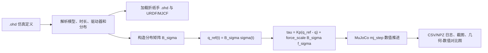
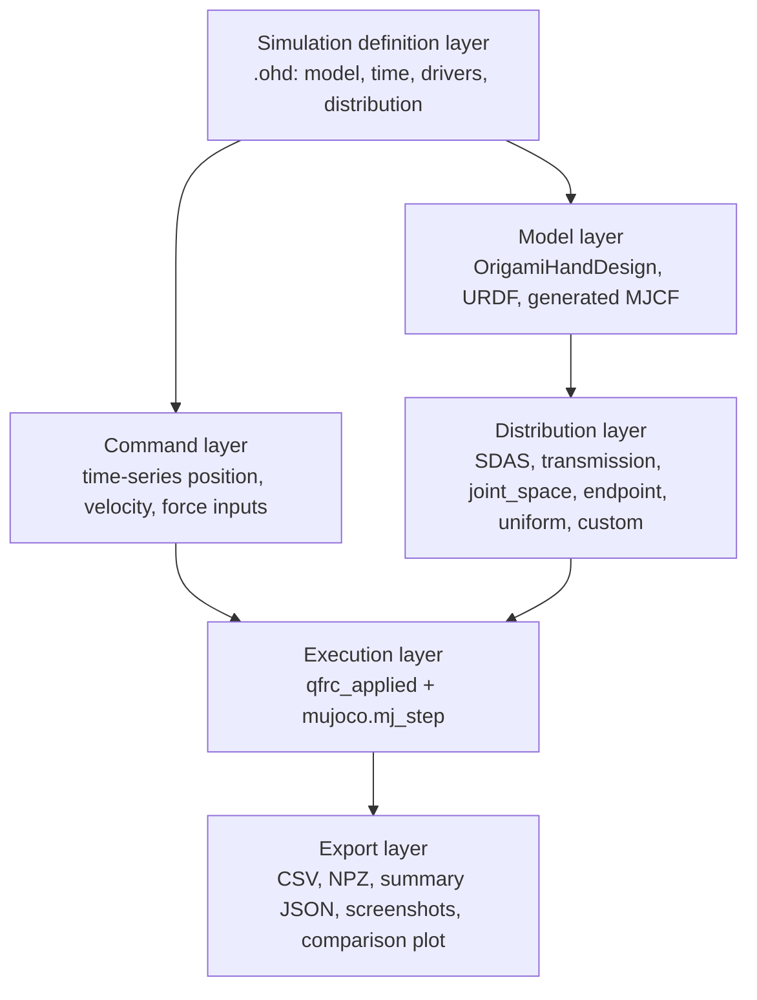
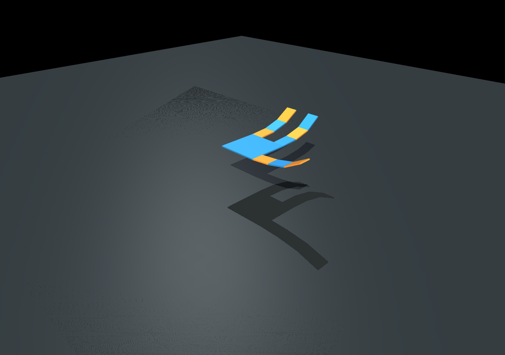
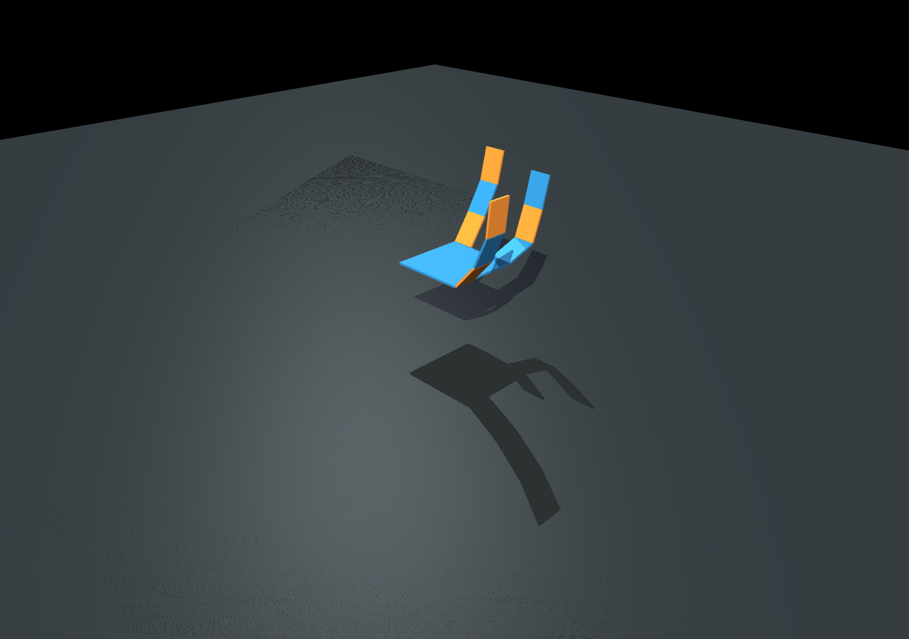
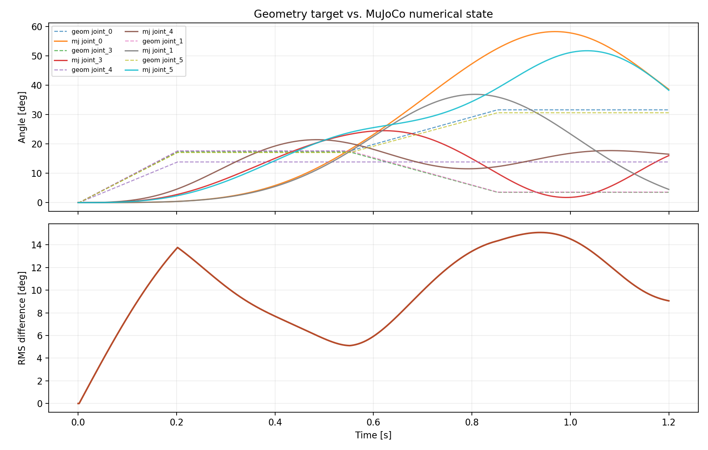

# SDAS 折纸灵巧手 MuJoCo 数值仿真项目报告

_面向 `synergy_hand_sim` 的项目总结、文献综述、实现报告与使用指南。本文统一使用 SDAS 作为模型名称；若早期文档或论文草稿中出现 FMAS，可视为同一模型在不同阶段的命名。_

---

## 项目概览

`synergy_hand_sim` 原本以折纸灵巧手的几何建模、运动学可视化和协同矩阵构造为核心：用户从 DXF 或 `.ohd` 文件定义折纸面片、折痕、驱动器、孔洞和腱绳路径，系统生成手部拓扑、URDF/STL 模型，并通过几何或准静态方式展示关节构型变化。

本次升级的目标是把“几何目标姿态”推进为“MuJoCo 数值仿真状态”。换句话说，原几何仿真给出的是目标构型 `q_ref`，新仿真进一步将 `q_ref` 或协同力输入映射到 MuJoCo 的广义关节力，由 MuJoCo 对关节惯性、约束和积分过程进行数值推进，输出随时间变化的实际关节状态 `q(t)`、速度 `q_dot(t)`、驱动力矩、截图和对比图。

本升级严格遵守两个边界：

1. **不加入阻尼器**：不使用 damper 元件，不加入粘滞阻尼、不使用速度阻尼反馈，也不复用旧动态协同模块中的阻尼器拓扑。
2. **仿真引擎唯一**：数值推进只使用 MuJoCo；几何仿真只作为目标构型和对比基线，不作为物理引擎。

升级后形成的主流程如下：



当前可复现实验位于：

| 项目 | 路径或结果 |
|---|---|
| 新核心实现 | `src/simulation/mujoco_sdas.py` |
| 新命令行入口 | `scripts/run_mujoco_sdas.py` |
| 示例 `.ohd` | `models/ohd test/mujoco_sdas_step.ohd` |
| 示例截图 1 | `outputs/mujoco_sdas/step_demo/mujoco_sdas_step_t0.350.png` |
| 示例截图 2 | `outputs/mujoco_sdas/step_demo/mujoco_sdas_step_t1.050.png` |
| 几何/数值对比图 | `outputs/mujoco_sdas/step_demo/mujoco_sdas_step_geometry_vs_mujoco.png` |
| 仿真日志 | `outputs/mujoco_sdas/step_demo/mujoco_sdas_step_log.csv` 和 `.npz` |
| 结果摘要 | `outputs/mujoco_sdas/step_demo/mujoco_sdas_step_summary.json` |
| 海报文件 | `docs/Physical Simulation/poster/sdas_mujoco_final_poster.pptx` |

---

## 详细项目报告

### 1. 原项目能力与不足

原项目的优势在于“从设计文件到可视化模型”的链路比较完整，主要包含以下模块：

| 模块 | 作用 | 本次升级中的处理 |
|---|---|---|
| `.ohd`/DXF 设计数据 | 描述折纸面片、折痕、驱动器、孔洞、腱绳路径 | 继续复用，作为仿真定义和模型定义入口 |
| `OrigamiHandDesign` | 保存折纸灵巧手拓扑和设计参数 | 继续复用 |
| `origami_to_urdf.py` | 将折纸设计导出为 URDF/STL | 继续复用，必要时自动生成 URDF |
| `transmission_builder.py` | 构建传动矩阵、SDAS 模型和协同方向 | 继续复用，用于生成分布矩阵 `B_sigma` |
| 旧几何/交互仿真 | 根据协同变量直接显示目标姿态 | 保留为几何基线，不再承担数值物理推进 |
| 旧自研动力学/动态协同模块 | 包含摩擦、速度项、阻尼器相关建模 | 本次新路径不复用这些阻尼相关计算 |
| MuJoCo viewer/URDF 显示 | 以可视化为主 | 升级为真正调用 `mj_step` 的数值仿真 |

原几何仿真的核心局限是：它可以告诉用户“协同输入希望手到哪里去”，但不能告诉用户“在惯性、关节约束和时间积分下，手实际怎样运动”。对于展示、调参和后续接触抓取研究而言，仅有几何姿态是不够的。因此本次升级引入 MuJoCo，目标是让 `.ohd` 文件直接驱动可重复、可记录、可截图的数值仿真。

### 2. 理论基础：从协同变量到关节分布

项目采用的基本变量如下：

| 符号 | 含义 |
|---|---|
| `q in R^n` | 手部 `n` 个关节角组成的构型向量 |
| `sigma in R^k` | `k` 维协同空间输入 |
| `S in R^{n x k}` | 姿态协同矩阵，每列是一种低维运动模式 |
| `R in R^{k x n}` | 腱绳/差动机构传动矩阵 |
| `E in R^{n x n}` | 关节等效刚度矩阵 |
| `B_sigma in R^{n x k}` | 本项目中实际用于 MuJoCo 控制的分布矩阵 |

姿态协同的最基本形式是：

```math
q = S\sigma
```

这表示用户不再独立控制每个关节，而是在低维协同空间中控制少量变量 `sigma`。对于折纸灵巧手，这个思想非常合适：折痕和腱绳天然会把多个自由度组织成少数几个成组运动。

自适应协同模型进一步把低维输入与机械传动联系起来。设腱绳驱动器位移为 `x`，传动约束为：

```math
R q = x
```

根据虚功原理，驱动器力与关节力矩满足对偶关系：

```math
\tau = R^\mathsf{T} \tau_M
```

在自由空间、忽略外部接触力时，考虑关节弹性 `E` 后，可得到从驱动输入到关节构型的等效映射：

```math
q = E^{-1}R^\mathsf{T}(R E^{-1}R^\mathsf{T})^{-1}x
```

因此可以定义：

```math
S_R = E^{-1}R^\mathsf{T}(R E^{-1}R^\mathsf{T})^{-1}
```

使得：

```math
q = S_R x
```

SDAS 的关键思想是在双端闭环腱绳系统中，用两个驱动端的非对称传动特性构造两个不同方向。文档 `docs/SDAS.md` 中给出的形式可概括为：

```math
\delta l_A = R_A \delta q
```

```math
\delta l_B = R_B \delta q
```

并由虚功关系得到：

```math
\delta W_A = f_A \delta l_A = \tau_A^\mathsf{T} \delta q
```

```math
\tau_A = R_A^\mathsf{T}f_A,\quad \tau_B = R_B^\mathsf{T}f_B
```

当引入刚度矩阵 `E` 后，每个驱动端都可以形成一个等效协同方向：

```math
S_A = E^{-1}R_A^\mathsf{T}(R_A E^{-1}R_A^\mathsf{T})^{-1}
```

```math
S_B = E^{-1}R_B^\mathsf{T}(R_B E^{-1}R_B^\mathsf{T})^{-1}
```

最终组合为：

```math
B_\sigma =
\begin{bmatrix}
S_A & S_B
\end{bmatrix}
```

这就是本项目数值仿真的核心接口：无论协同方向来自经典姿态协同、固定传动矩阵、SDAS 双端传动、末端启发式分布，还是用户自定义矩阵，最终都统一成 `B_sigma`。

### 3. 数值仿真模型

MuJoCo 内部推进的动力学可以抽象写为：

```math
M(q)\ddot{q} + h(q,\dot{q}) = \tau_\mathrm{applied} + J_c(q)^\mathsf{T}\lambda
```

其中 `M(q)` 是质量矩阵，`h(q,q_dot)` 包含科氏项、重力项等 MuJoCo 内部项，`J_c^T lambda` 是约束/接触项。当前示例中为了突出协同驱动和数值推进，重力设置为零，几何接触也默认关闭；但接口保留了 `ncon` 日志，后续可扩展到接触抓取。

本项目没有手写完整动力学方程，而是把用户输入转化为 MuJoCo 的广义力：

```math
\tau_\mathrm{applied}(t)
= K_p(q_\mathrm{ref}(t)-q(t))
+ \alpha B_\sigma f_\sigma(t)
```

其中：

```math
q_\mathrm{ref}(t) = B_\sigma \sigma(t)
```

`K_p` 是位置跟踪增益，`alpha` 是力输入缩放因子，`f_sigma(t)` 是协同空间中的力型输入。

这条控制律看起来像“弹簧式位置跟踪”，但它不含速度反馈：

```math
\tau_\mathrm{damping} = -D\dot{q}
```

上述阻尼项没有出现在实现中。`velocity` 类型驱动器也不是速度阻尼器，它只是把用户给定的协同速度积分为协同位置：

```math
\sigma_i(t+\Delta t) = \sigma_i(t) + v_i(t)\Delta t
```

也就是说，速度驱动器只是输入格式的一种，不会形成 `-D q_dot` 或类似阻尼反馈。

### 4. 无阻尼器约束的工程落实

为了确保“不加入阻尼器”不是口头约束，而是落实到代码结构中，新实现采用了以下做法：

| 层级 | 做法 |
|---|---|
| MJCF 结构 | 不生成 `<actuator>`，不生成 `<damper>`，关节不设置 `damping` |
| 控制律 | 只使用 `Kp(q_ref - q)` 和力输入映射，不使用 `Kd q_dot` |
| 旧模块边界 | 不调用 `dynamic_synergy.py` 中的阻尼器拓扑，不调用旧自研 ODE 的阻尼/粘滞摩擦项 |
| 审计方式 | 对生成 MJCF 搜索 `damping`、`damper`、`velocity`，示例文件无匹配 |
| 日志标记 | `SimulationTrajectory.info["no_damper_terms"] = True` |

需要注意：MuJoCo 作为物理引擎本身具有约束求解器和数值稳定机制，这不是本项目人为加入的阻尼器模型。当前生成的 MJCF 没有阻尼器元件，也没有显式速度阻尼项。

### 5. 新代码结构

本次升级新增或修改的主要文件如下：

| 文件 | 作用 |
|---|---|
| `src/simulation/mujoco_sdas.py` | 核心实现：解析 `.ohd`、构建 MJCF、构建分布矩阵、运行 MuJoCo、记录日志和截图 |
| `scripts/run_mujoco_sdas.py` | 命令行入口：从 `.ohd` 启动仿真，可覆盖输出目录、时长和时间步长 |
| `models/ohd test/mujoco_sdas_step.ohd` | 示例仿真定义：两路 SDAS position 驱动 |
| `tests/test_mujoco_sdas.py` | 单元测试：覆盖解析、驱动插值、输出生成和无阻尼审计 |
| `docs/mujoco_sdas_upgrade.md` | 简版技术说明 |
| `docs/Physical Simulation/poster/sdas_mujoco_final_poster.pptx` | 海报展示文件 |

新实现可分为五层：



### 6. `.ohd` 解析策略

新入口支持两类 `.ohd`：

1. **手部设计文件**：文件本身包含 `fold_lines` 等设计信息。此时系统会把它当作手部模型，使用默认仿真参数。
2. **仿真定义文件**：文件包含 `hand_model_path`、`urdf_path` 和 `simulation` 字段。此时它作为一次实验的配置文件。

仿真定义文件的关键字段如下：

| 字段 | 类型 | 说明 |
|---|---|---|
| `hand_model_path` | string | 手部 `.ohd` 模型路径 |
| `urdf_path` | string，可选 | 已导出的 URDF 路径；缺省时自动寻找或导出 |
| `simulation.label` | string | 输出文件名前缀 |
| `simulation.duration` | float | 仿真总时长，单位秒 |
| `simulation.dt` | float | MuJoCo 时间步长 |
| `simulation.distribution` | object | 分布仿真类型与参数 |
| `simulation.drivers` | list | 驱动器输入序列 |
| `simulation.control.position_kp` | float | 位置跟踪广义力增益 |
| `simulation.control.force_scale` | float | 力输入缩放 |
| `simulation.physics.gravity` | list[float] | 重力向量 |
| `simulation.physics.body_mass` | float | 每个 link 的简化质量 |
| `simulation.physics.joint_inertia` | float | 关节 armature/简化惯量 |
| `simulation.physics.model_scale` | float | URDF 几何缩放 |
| `simulation.render.width/height` | int | 截图分辨率 |
| `simulation.output.dir` | string | 输出目录 |
| `simulation.output.screenshots` | list[float] | 需要截图的仿真时刻 |

示例文件为：

```json
{
  "hand_model_path": "three_finger_gripper_b.ohd",
  "urdf_path": "../three_finger_gripper_b/three_finger_gripper_b.urdf",
  "simulation": {
    "label": "mujoco_sdas_step",
    "duration": 1.2,
    "dt": 0.002,
    "distribution": {
      "type": "sdas"
    },
    "drivers": [
      {
        "name": "sigma",
        "type": "position",
        "samples": [
          [0.0, 0.0],
          [0.20, 8.0],
          [1.20, 8.0]
        ]
      },
      {
        "name": "sigma_diff",
        "type": "position",
        "samples": [
          [0.0, 0.0],
          [0.55, 0.0],
          [0.85, 3.0],
          [1.20, 3.0]
        ]
      }
    ],
    "control": {
      "position_kp": 0.012,
      "force_scale": 0.01
    },
    "physics": {
      "gravity": [0.0, 0.0, 0.0],
      "body_mass": 0.03,
      "joint_inertia": 0.00008,
      "model_scale": 0.001
    },
    "render": {
      "width": 1280,
      "height": 900
    },
    "output": {
      "dir": "../../outputs/mujoco_sdas/step_demo",
      "screenshots": [0.35, 1.05]
    }
  }
}
```

### 7. 分布仿真功能

分布仿真的作用是回答一个问题：每个用户输入应该作用到哪些关节、以什么权重作用？新实现把答案统一表示为 `B_sigma`。

当前支持以下分布类型：

| 类型 | 含义 | 适用场景 |
|---|---|---|
| `sdas` | 从 `.ohd` 设计中构建 SDAS 模型，取双端协同方向 | 默认推荐，用于展示 SDAS 双驱动协同 |
| `transmission` | 与 `sdas` 使用同一路径，优先构造传动/协同方向 | 需要强调传动矩阵来源时使用 |
| `joint_space` | 第 `i` 个输入直接控制第 `i` 个关节 | 调试单关节响应、检查 MuJoCo 模型 |
| `endpoint` | 默认选取末端若干关节形成启发式分布 | 末端姿态实验的简化入口 |
| `uniform` | 第一列为全关节均匀闭合，第二列为线性差动 | 快速演示共模/差模输入 |
| custom matrix | 用户直接提供矩阵 | 论文实验、消融实验、自定义协同方向 |

自定义矩阵可以写成：

```json
{
  "distribution": {
    "type": "custom",
    "matrix": [
      [1.0, 0.0],
      [0.8, 0.1],
      [0.6, -0.2]
    ]
  }
}
```

矩阵行数应等于 MuJoCo 关节数，列数应等于驱动器数。如果用户写成转置形式，代码会在维度可判定时自动转置。

### 8. 驱动器输入

每个驱动器包含 `name`、`type` 和 `samples`。`samples` 是时间-数值序列，仿真时按线性插值计算当前值。

```json
{
  "name": "sigma",
  "type": "position",
  "samples": [[0.0, 0.0], [0.2, 8.0], [1.2, 8.0]]
}
```

支持三种输入类型：

| 类型 | 计算方式 | 是否含阻尼 |
|---|---|---|
| `position` | 当前值直接作为 `sigma_i(t)` | 否 |
| `velocity` | 当前值作为 `d sigma_i / dt`，积分得到 `sigma_i(t)` | 否 |
| `force` | 当前值作为协同空间力 `f_sigma_i(t)`，映射为关节广义力 | 否 |

对于 position/velocity 输入：

```math
q_\mathrm{ref}(t) = B_\sigma\sigma(t)
```

对于 force 输入：

```math
\tau_\mathrm{force}(t) = \alpha B_\sigma f_\sigma(t)
```

最终广义力：

```math
\tau(t) = K_p(q_\mathrm{ref}(t)-q(t)) + \tau_\mathrm{force}(t)
```

### 9. MuJoCo 模型构建

实现会从 URDF 读取 link、joint、mesh、axis、limit 等信息，并生成一个简化 MJCF。核心原则如下：

| 内容 | 当前处理方式 |
|---|---|
| 关节 | URDF revolute/hinge 关节转为 MuJoCo hinge |
| 关节限制 | 继承 URDF limit，写入 `range` |
| 惯量 | 使用 `body_mass` 和 `joint_inertia` 做简化配置 |
| mesh | 从 URDF 中解析 STL/mesh 路径 |
| actuator | 不生成 |
| damper/damping | 不生成 |
| 接触 | 示例中默认关闭 mesh 接触，便于隔离协同驱动响应 |
| 截图 | 使用 MuJoCo offscreen renderer；失败时回退为关节角柱状图 |

这种模型不是最终硬件级高保真模型，而是一个清晰、可审计、可复现实验的数值仿真接口。它的价值在于打通了：

```text
.ohd 设计 -> SDAS 分布 -> MuJoCo 数值推进 -> 日志/截图/对比图
```

### 10. 示例验证结果

示例命令：

```powershell
python scripts\run_mujoco_sdas.py "models\ohd test\mujoco_sdas_step.ohd"
```

运行结果摘要：

| 指标 | 数值 |
|---|---|
| 仿真时长 | `1.2 s` |
| 时间步长 | `0.002 s` |
| 步数 | `600` |
| 关节数 | `9` |
| 驱动器数 | `2` |
| 分布类型 | `sdas` |
| 几何目标与 MuJoCo 状态 RMS 差异 | `0.18483191243568511 rad` |
| 最大绝对差异 | `0.5661104019953029 rad` |

测试结果：

```powershell
python -m pytest tests\test_mujoco_sdas.py -q
```

结果为 `3 passed`，另有 3 个 NumPy 标量转换相关的 deprecation warnings，来源于旧 `src/synergy/sdas_model.py` 中的标量转换方式，不影响本次 MuJoCo 数值仿真路径。

无阻尼审计命令：

```powershell
Select-String -Path outputs\mujoco_sdas\step_demo\mujoco_sdas_step.xml -Pattern "damping|damper|velocity"
```

示例生成的 MJCF 中无匹配项。

示例截图如下：





几何目标与 MuJoCo 数值状态对比：



从对比图可以看到：几何仿真给出的 `q_ref` 是“目标轨迹”，MuJoCo 输出的 `q` 是在广义力、惯量和积分过程下的“实际状态”。二者不完全重合是正常现象，这正是从几何仿真升级到数值仿真的意义。若提高 `position_kp`，实际状态会更快接近目标，但也更容易出现数值刚性；若降低 `position_kp`，响应更柔和，但滞后和误差会增大。

---

## 文献综述

### 1. 姿态协同：低维手部控制的起点

Santello 等关于人手抓握姿态的研究通常被视为姿态协同理论的重要起点。其实验观察表明，人手在抓握不同物体时，虽然有大量关节自由度，但主要变化可以由少数几个主成分解释。这对应到工程上，就是用低维向量 `sigma` 表示高维关节构型 `q`：

```math
q = S\sigma
```

对折纸灵巧手而言，这个结论提供了两个启发：

1. 不必为每个折痕/关节配置独立驱动器。
2. 控制接口可以设计成少量“全手闭合”“差动弯曲”“指间重分配”等协同输入。

但纯姿态协同的不足也很明显：它主要描述自由空间中的手部姿态，不直接处理接触、顺应性和欠驱动机械实现。

### 2. 软协同：从目标姿态到顺应抓取

Bicchi、Gabiccini 等提出的 soft synergy 模型把协同参考构型与关节柔顺性结合起来。其基本形式可写为：

```math
q = S\sigma - C J^\mathsf{T}f_\mathrm{ext}
```

这里 `C` 是柔顺矩阵，`J^T f_ext` 是外力映射到关节空间的力矩。这个式子表达了一个重要思想：协同输入给出参考姿态，但手在接触物体时可以沿柔顺方向被动变形。

该思想对本项目的意义在于：几何目标 `q_ref = S sigma` 不应该被视为最终真实状态，而应该作为物理仿真的参考输入。实际状态 `q` 应由动力学和接触环境共同决定。MuJoCo 正好承担这一层数值求解任务。

### 3. 自适应协同与 Pisa/IIT SoftHand

Pisa/IIT SoftHand 系列工作将 soft synergy 思想进一步落实到机械结构中。其核心贡献不是单纯“用少量电机驱动很多关节”，而是通过腱绳、差动机构和弹性元件，让手在低维主动输入下仍保留高维被动顺应能力。

经典自适应协同可用传动矩阵 `R` 表示：

```math
R q = x
```

其中 `x` 是驱动器位移。力学对偶关系给出：

```math
\tau = R^\mathsf{T}\tau_M
```

再结合关节刚度 `E`，得到自由空间中从驱动器位移到关节构型的映射：

```math
q = E^{-1}R^\mathsf{T}(R E^{-1}R^\mathsf{T})^{-1}x
```

这为本项目提供了最直接的数学接口：只要能从 `.ohd` 里的腱绳路径、折痕顺序和等效刚度生成 `R` 与 `E`，就能生成一个分布矩阵，把用户输入映射到各个关节。

### 4. SoftHand Pro-D 与动态协同

SoftHand Pro-D 相关工作关注假肢控制中的动态输入内容匹配。其思路是：用户命令的速度、频率或动态特征可以改变手的响应方向，从而在慢速闭合和快速闭合中呈现不同的抓取行为。

这类工作通常会引入速度相关项、阻尼网络或动态协同切换。例如动态协同模型中常见的核心对象包括：

| 对象 | 作用 |
|---|---|
| 腱绳/差动传动矩阵 | 描述驱动输入如何分布到关节 |
| 阻尼器拓扑 | 让动态响应依赖速度和频率 |
| 快/慢协同方向 | 让不同输入速度对应不同手势 |
| 速度相关状态 | 用于动态切换或连续变形 |

这些思想对理解 SoftHand 系列非常重要，但本项目当前版本没有采用其中的阻尼器实现。原因是用户明确要求“数值仿真升级不包含阻尼器相关部分”。因此本项目只吸收其“多协同方向、输入映射、分布设计”的抽象思想，不实现阻尼器、速度阻尼或动态摩擦积分。

### 5. SoftHand 2 与增强自适应协同

Della Santina 等关于 Pisa/IIT SoftHand 2 的工作强调：通过改变腱绳相对滑动和传动路径，可以让一只欠驱动手获得额外的协同方向。该思路可以概括为：普通闭合输入产生第一协同方向，腱绳相对滑动或路径非对称性产生第二协同方向。

论文中的动力学形式可抽象为：

```math
B(q)\ddot{q} + W(q,\dot{q})\dot{q} + \Gamma(q)
= Q(q)u + J(q)^\mathsf{T}f_\mathrm{ext}
```

其中 `u` 包含电机力矩、滑动变量以及可能的速度相关输入。完整模型中还会涉及摩擦、阻尼和动态项。

本项目对 SoftHand 2 的取舍是：

| SoftHand 2 思想 | 本项目采用方式 |
|---|---|
| 多协同方向 | 采用，统一表示为 `B_sigma` 的多列 |
| 传动矩阵到关节空间的映射 | 采用，作为 SDAS/传动分布的理论依据 |
| 腱路顺序改变第二方向 | 作为后续 SDAS 分布设计思路保留 |
| 阻尼器和速度阻尼 | 不采用 |
| 完整电机闭环控制 | 不采用 |
| 接触抓取评价 | 当前接口预留，后续扩展 |

因此，当前升级不是 SoftHand 2 的完整复现，而是一个面向折纸 SDAS 手的工程化、无阻尼 MuJoCo 数值仿真框架。

### 6. SDAS 与本项目的关系

SDAS 即 state-dependent adaptive synergy，中文可称“状态依赖自适应协同”。相较经典自适应协同只使用固定传动矩阵 `R`，SDAS 关注在双端闭环腱绳系统中，由路径、张紧状态和局部摩擦状态导致的有效传动差异。

文档 `docs/SDAS.md` 中的核心思想是：

1. 驱动器 A 和 B 对应不同传动向量或传动矩阵 `R_A`、`R_B`。
2. 二者通过虚功原理分别映射为关节力矩。
3. 在合适设计下，两个驱动端可以近似独立地产生两个协同方向。
4. 系统因此可以用两个驱动器形成二维协同空间。

对于当前项目，SDAS 的工程落点不是直接模拟腱绳内部摩擦传播，而是把它抽象成可配置的分布矩阵：

```math
B_\sigma =
\begin{bmatrix}
b_1 & b_2 & \cdots & b_k
\end{bmatrix}
```

每一列 `b_i` 表示一个驱动器输入对所有关节的分布。这样做有三个优点：

1. **接口统一**：SDAS、经典传动、末端分布、自定义分布都能走同一个 MuJoCo 控制流程。
2. **便于审计**：只要检查 `B_sigma` 和控制律，就能判断是否引入了禁止项。
3. **便于扩展**：未来可以替换分布矩阵生成器，而不改 MuJoCo 执行层。

### 7. 文献到实现的映射表

| 文献/理论 | 核心公式或思想 | 本项目中的实现 |
|---|---|---|
| 姿态协同 | `q = S sigma` | 几何目标构型 `q_ref` |
| Soft synergy | `q = S sigma - C J^T f_ext` | 用 MuJoCo 让实际 `q` 偏离几何目标，保留后续接触扩展 |
| Adaptive synergy | `q = E^{-1}R^T(RE^{-1}R^T)^{-1}x` | 从传动矩阵生成分布方向 |
| Pisa/IIT SoftHand | 欠驱动、低维主动、高维被动顺应 | `.ohd -> B_sigma -> MuJoCo` |
| SoftHand Pro-D | 动态协同、速度/阻尼相关响应 | 仅作综述背景，当前不实现阻尼器 |
| SoftHand 2 | 增强自适应协同、第二协同方向 | 采用多列 `B_sigma` 抽象 |
| SDAS | `R_A/R_B` 形成状态相关双端协同 | 默认 `distribution.type = "sdas"` |

---

## 新数值仿真功能使用指南

### 1. 安装依赖

项目原有依赖仍然适用。为了运行新 MuJoCo 数值仿真，至少需要：

```powershell
pip install mujoco numpy matplotlib pandas pillow
```

如果要运行测试，还需要：

```powershell
pip install pytest
```

在本仓库根目录运行命令：

```powershell
cd E:\SGLab\cable-driven\synergy_hand_sim
```

### 2. 最快运行示例

直接运行示例 `.ohd`：

```powershell
python scripts\run_mujoco_sdas.py "models\ohd test\mujoco_sdas_step.ohd"
```

运行后会在以下目录生成结果：

```text
outputs/mujoco_sdas/step_demo
```

你会看到：

| 文件 | 含义 |
|---|---|
| `mujoco_sdas_step.xml` | 自动生成的无阻尼 MJCF |
| `mujoco_sdas_step_log.csv` | 表格日志，适合 Excel/Origin/Matlab/Python 读取 |
| `mujoco_sdas_step_log.npz` | 压缩数组日志，适合 Python 后处理 |
| `mujoco_sdas_step_summary.json` | 本次运行摘要 |
| `mujoco_sdas_step_t0.350.png` | 0.35 秒截图 |
| `mujoco_sdas_step_t1.050.png` | 1.05 秒截图 |
| `mujoco_sdas_step_geometry_vs_mujoco.png` | 几何目标和 MuJoCo 状态对比图 |

### 3. 覆盖输出目录、时长和步长

可以在命令行覆盖部分参数：

```powershell
python scripts\run_mujoco_sdas.py "models\ohd test\mujoco_sdas_step.ohd" --out outputs\my_run
```

```powershell
python scripts\run_mujoco_sdas.py "models\ohd test\mujoco_sdas_step.ohd" --duration 2.0 --dt 0.001
```

`--duration` 改变仿真总时长，`--dt` 改变 MuJoCo 时间步长。较小的 `dt` 通常更稳定，但运行更慢。

### 4. 编写自己的仿真 `.ohd`

推荐复制示例文件：

```text
models/ohd test/mujoco_sdas_step.ohd
```

然后改四类内容：

1. `hand_model_path`：换成你的手部 `.ohd`。
2. `urdf_path`：如果已有 URDF，填 URDF 路径；没有可先留空或让程序自动生成。
3. `simulation.drivers`：改输入曲线。
4. `simulation.distribution`：改分布类型或矩阵。

最小示例：

```json
{
  "hand_model_path": "three_finger_gripper_b.ohd",
  "simulation": {
    "label": "my_first_mujoco_run",
    "duration": 1.0,
    "dt": 0.002,
    "distribution": {
      "type": "uniform"
    },
    "drivers": [
      {
        "name": "close",
        "type": "position",
        "samples": [[0.0, 0.0], [0.3, 5.0], [1.0, 5.0]]
      }
    ],
    "output": {
      "dir": "../../outputs/mujoco_sdas/my_first_mujoco_run",
      "screenshots": [0.3, 1.0]
    }
  }
}
```

运行：

```powershell
python scripts\run_mujoco_sdas.py "models\ohd test\my_first_mujoco_run.ohd"
```

### 5. 使用 SDAS 双驱动输入

如果希望两个驱动器分别对应 SDAS 的两个协同方向，可以写：

```json
"distribution": {
  "type": "sdas"
},
"drivers": [
  {
    "name": "sigma_A",
    "type": "position",
    "samples": [[0.0, 0.0], [0.2, 8.0], [1.2, 8.0]]
  },
  {
    "name": "sigma_B",
    "type": "position",
    "samples": [[0.0, 0.0], [0.6, 0.0], [0.9, 3.0], [1.2, 3.0]]
  }
]
```

解释：

| 驱动器 | 作用 |
|---|---|
| `sigma_A` | 第一协同方向，通常可理解为主闭合方向 |
| `sigma_B` | 第二协同方向，通常可理解为差动/重分配方向 |

具体每个方向控制哪些关节，由 `.ohd` 中的 SDAS 模型和传动构造决定。

### 6. 使用单关节调试分布

当你怀疑 URDF 关节顺序、轴向或限位有问题时，建议先用 `joint_space`：

```json
"distribution": {
  "type": "joint_space",
  "columns": 3
},
"drivers": [
  {
    "name": "joint_0_test",
    "type": "position",
    "samples": [[0.0, 0.0], [0.2, 1.0], [1.0, 1.0]]
  }
]
```

这会让第一个输入主要作用到第一个关节。若关节转动方向或幅值异常，优先检查 URDF 的 joint axis、limit 和模型缩放。

### 7. 使用自定义分布

当你已经从论文、优化器或外部脚本得到一个协同矩阵，可以直接写：

```json
"distribution": {
  "type": "custom",
  "matrix": [
    [0.90, 0.10],
    [0.75, 0.20],
    [0.50, 0.30],
    [0.20, -0.40],
    [0.10, -0.60]
  ]
}
```

然后定义两个驱动器：

```json
"drivers": [
  {
    "name": "mode_1",
    "type": "position",
    "samples": [[0.0, 0.0], [0.4, 6.0], [1.0, 6.0]]
  },
  {
    "name": "mode_2",
    "type": "position",
    "samples": [[0.0, 0.0], [0.7, 2.0], [1.0, 2.0]]
  }
]
```

这样可以非常方便地做消融实验，例如：

| 实验 | distribution |
|---|---|
| 只使用主闭合 | 自定义矩阵只保留第一列 |
| 加入差动方向 | 使用两列矩阵 |
| 对比 SDAS 与均匀分布 | 分别运行 `sdas` 和 `uniform` |
| 对比几何与数值差异 | 查看 `*_geometry_vs_mujoco.png` 和日志中的 `q`/`qref` |

### 8. 使用力输入

如果希望直接施加协同空间力，而不是位置目标，可以写：

```json
"drivers": [
  {
    "name": "force_close",
    "type": "force",
    "samples": [[0.0, 0.0], [0.1, 4.0], [1.0, 4.0]]
  }
],
"control": {
  "position_kp": 0.0,
  "force_scale": 0.01
}
```

此时：

```math
\tau(t) = \alpha B_\sigma f_\sigma(t)
```

如果还同时存在 position 驱动，则两部分会相加。

### 9. 使用速度输入

如果希望输入“协同速度命令”，可以写：

```json
"drivers": [
  {
    "name": "slow_close",
    "type": "velocity",
    "samples": [[0.0, 0.0], [0.1, 5.0], [0.8, 5.0], [1.0, 0.0]]
  }
]
```

这表示：

```math
\sigma(t+\Delta t) = \sigma(t) + v(t)\Delta t
```

它只是命令积分，不是阻尼器，也不是速度反馈控制。

### 10. 读取日志

CSV 日志列名规则如下：

| 列名 | 含义 |
|---|---|
| `t` | 时间 |
| `ncon` | MuJoCo 当前接触数量 |
| `q_<joint_name>` | MuJoCo 实际关节角 |
| `qref_<joint_name>` | 几何/协同目标关节角 |
| `tau_<joint_name>` | 当前施加到关节的广义力 |
| `input_<driver_name>` | 驱动器输入值 |

用 Python 读取：

```python
import pandas as pd

df = pd.read_csv("outputs/mujoco_sdas/step_demo/mujoco_sdas_step_log.csv")
print(df.columns)
print(df[["t", "input_sigma", "input_sigma_diff"]].head())
```

读取 `.npz`：

```python
import numpy as np

data = np.load("outputs/mujoco_sdas/step_demo/mujoco_sdas_step_log.npz")
print(data.files)
q = data["q"]
q_ref = data["q_ref"]
tau = data["tau"]
```

### 11. 如何判断结果是否合理

建议按以下顺序检查：

1. **MJCF 审计**：搜索 `damping`、`damper`、`velocity`，应无匹配。
2. **截图**：确认手部模型不为空、姿态随输入变化。
3. **输入曲线**：检查 CSV 中 `input_*` 是否符合 `.ohd` 设定。
4. **关节目标**：检查 `qref_*` 是否按预期变化。
5. **数值状态**：检查 `q_*` 是否跟随 `qref_*`，但允许存在滞后。
6. **误差图**：查看 `*_geometry_vs_mujoco.png` 中 RMS 是否在可解释范围内。
7. **增益扫描**：必要时调整 `position_kp`、`force_scale` 和 `dt`。

### 12. 常见问题

| 问题 | 可能原因 | 处理方式 |
|---|---|---|
| 运行时报找不到手部 `.ohd` | `hand_model_path` 相对路径不对 | 路径相对于仿真 `.ohd` 文件所在目录 |
| 找不到 URDF | `urdf_path` 不存在 | 删除 `urdf_path` 让程序自动找，或先运行 URDF 导出脚本 |
| 截图为空或渲染失败 | MuJoCo offscreen 环境问题 | 程序会回退生成关节角图；也可检查显卡/OpenGL 环境 |
| 关节几乎不动 | `position_kp` 或 `force_scale` 太小 | 逐步增大，避免一次调太大 |
| 关节抖动或数值不稳 | `position_kp` 太大或 `dt` 太大 | 降低 `position_kp` 或减小 `dt` |
| SDAS 方向不符合预期 | `.ohd` 中传动/孔洞/折痕定义不理想 | 先用 `uniform` 或 `joint_space` 排除 MuJoCo/URDF 问题 |
| `endpoint` 分布效果简单 | 当前是启发式末端关节分布 | 后续可扩展为真正的雅可比/IK 末端分布 |
| CSV 中没有接触力 | 当前只记录 `ncon` | 后续可从 MuJoCo contact/frame 数据扩展接触力日志 |

### 13. 无阻尼器检查清单

每次准备正式展示或写入论文前，建议执行：

```powershell
python scripts\run_mujoco_sdas.py "models\ohd test\mujoco_sdas_step.ohd"
Select-String -Path outputs\mujoco_sdas\step_demo\mujoco_sdas_step.xml -Pattern "damping|damper|velocity"
python -m pytest tests\test_mujoco_sdas.py -q
```

合格标准：

| 检查项 | 期望结果 |
|---|---|
| MJCF 搜索 | 无输出 |
| pytest | 通过 |
| 截图 | 至少两张不同姿态 |
| 对比图 | `qref` 与 `q` 均有曲线 |
| 摘要 JSON | `distribution`、`rms_error_rad`、`screenshots` 字段存在 |

---

## 新增接触抓取 Demo

在本文初稿之后，数值仿真接口已经加入接触/碰撞和物体配置能力。`.ohd` 文件现在可以通过 `contact` 字段打开手-物体、物体-地面的 MuJoCo 接触，并通过 `objects` 字段加入 box、sphere、cylinder、capsule 等 procedural 物体，或导入外部 MuJoCo scanned object 资产。

已完成的四个 demo：

| Demo | 输入文件 | 输出目录 | 接触步数 | 最大接触数 |
|---|---|---|---:|---:|
| box | `models/ohd test/mujoco_sdas_grasp_box.ohd` | `outputs/mujoco_sdas/grasp_box` | 146 | 5 |
| cylinder | `models/ohd test/mujoco_sdas_grasp_cylinder.ohd` | `outputs/mujoco_sdas/grasp_cylinder` | 158 | 5 |
| sphere | `models/ohd test/mujoco_sdas_grasp_sphere.ohd` | `outputs/mujoco_sdas/grasp_sphere` | 531 | 2 |
| scanned mug | `models/ohd test/mujoco_sdas_grasp_scanned_mug.ohd` | `outputs/mujoco_sdas/grasp_scanned_mug` | 209 | 7 |

外部物体资产来自 `kevinzakka/mujoco_scanned_objects`，本项目已在 `assets/mujoco_scanned_objects` 中保存 coffee mug、Jenga block 和 hammer ball 三个示例资产及许可说明。详细说明见 `docs/mujoco_contact_grasp_demos.md`。


## 当前局限与后续建议

当前版本已经完成了从 `.ohd` 到 MuJoCo 数值仿真的主链路，但仍有几个自然的后续方向：

| 方向 | 建议 |
|---|---|
| 接触抓取 | 已完成基础接口；后续应加入更真实的指尖厚度、接触力标定和物体抓稳评价 |
| 末端分布 | 将 `endpoint` 从启发式关节选择升级为基于雅可比的任务空间分布 |
| 惯性建模 | 从 STL/几何面片估计更真实的 link 惯量，而不是统一简化质量 |
| 参数扫描 | 自动扫描 `position_kp`、`force_scale`、`dt`，给出稳定性和误差曲线 |
| 海报增强 | 把本文的“理论-接口-验证-局限”结构压缩成四栏海报内容 |
| GUI | 用 PyQt 或 MuJoCo viewer 做文件选择、参数编辑、运行和截图预览 |
| 论文实验 | 对比 `sdas`、`uniform`、`custom` 三类分布在 RMS 误差和姿态差异上的结果 |

如果要丰富海报，建议增加以下内容块：

1. **问题定义**：原几何仿真无法给出动态响应，只能给目标姿态。
2. **理论接口**：`R_A/R_B -> B_sigma -> q_ref`。
3. **工程接口**：`.ohd -> parser -> MuJoCo mj_step -> logs/screenshots`。
4. **无阻尼声明**：明确排除 `damper`、`damping`、`-D q_dot`。
5. **结果展示**：两张姿态截图加一张几何/数值对比图。
6. **后续路线**：接触抓取、末端分布、GUI、参数扫描。

---

## 参考文献与项目文件

### 参考文献

1. Santello, M., Flanders, M., and Soechting, J. F. Postural hand synergies for tool use. _Journal of Neuroscience_, 1998.
2. Bicchi, A., Gabiccini, M., and Santello, M. Modelling natural and artificial hands with synergies. _Philosophical Transactions of the Royal Society B_, 2011.
3. Catalano, M. G., Grioli, G., Farnioli, E., Serio, A., Piazza, C., and Bicchi, A. Adaptive synergies for the design and control of the Pisa/IIT SoftHand. _International Journal of Robotics Research_, 2014.
4. Piazza, C., et al. SoftHand Pro-D: Matching dynamic content of natural user commands with hand embodiment for enhanced prosthesis control.
5. Della Santina, C., et al. Toward Dexterous Manipulation With Augmented Adaptive Synergies: The Pisa/IIT SoftHand 2.
6. Todorov, E., Erez, T., and Tassa, Y. MuJoCo: A physics engine for model-based control. _IEEE/RSJ International Conference on Intelligent Robots and Systems_, 2012.

### 项目文件

| 文件 | 说明 |
|---|---|
| `docs/SDAS.md` | SDAS 理论推导，本文第二章理论基础主要来自这里 |
| `docs/mujoco_upgrade_softHand2_notes.md` | SoftHand 2 数值方法提要 |
| `docs/mujoco_sdas_upgrade.md` | 本次升级简版技术说明 |
| `src/simulation/mujoco_sdas.py` | MuJoCo SDAS 数值仿真核心 |
| `scripts/run_mujoco_sdas.py` | 命令行运行入口 |
| `models/ohd test/mujoco_sdas_step.ohd` | 示例输入文件 |
| `tests/test_mujoco_sdas.py` | 自动化测试 |
| `outputs/mujoco_sdas/step_demo` | 示例输出目录 |
| `docs/Physical Simulation/poster/sdas_mujoco_final_poster.pptx` | 最终海报 PPTX |

---

## 一句话总结

本次升级把 `synergy_hand_sim` 从“根据协同矩阵显示几何目标姿态”推进到“用 `.ohd` 定义实验、用 SDAS/自定义分布生成协同输入、用 MuJoCo 进行无阻尼数值仿真，并自动输出日志、截图和对比图”的完整工作流。它没有复现 SoftHand 系列中包含阻尼器的动态协同部分，而是保留了最适合折纸 SDAS 手的低维分布控制思想，为后续接触抓取、末端任务分布和更丰富的论文/海报展示打好了接口基础。
